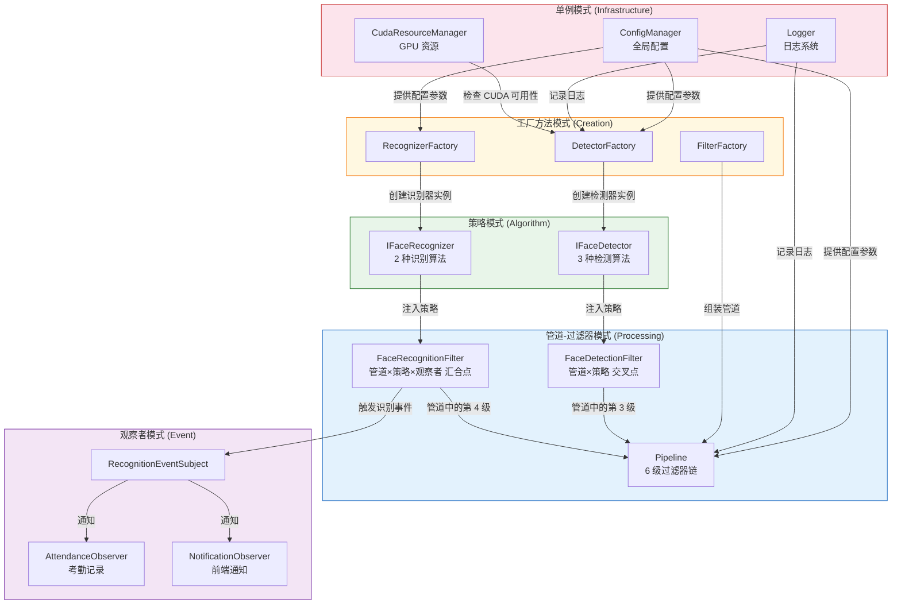
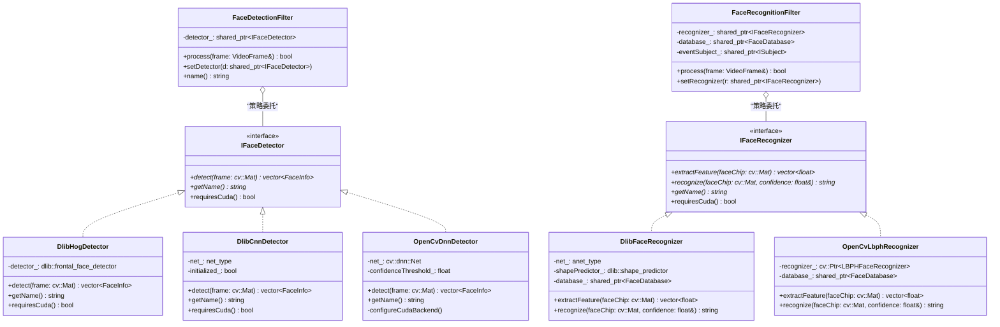
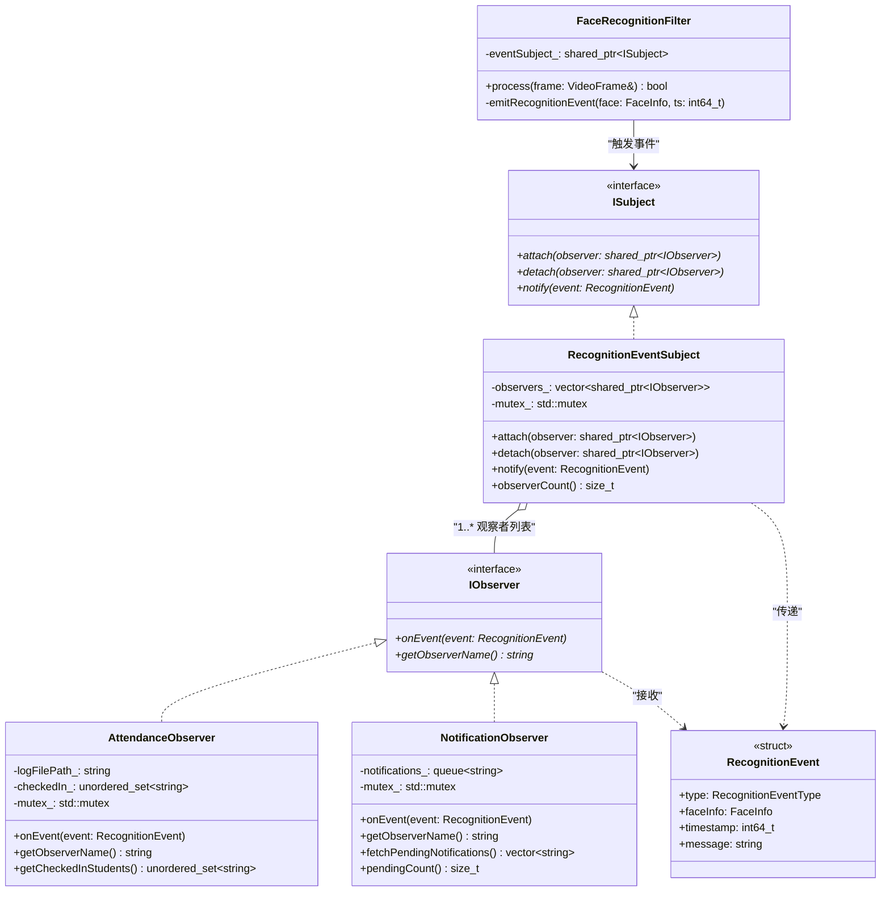
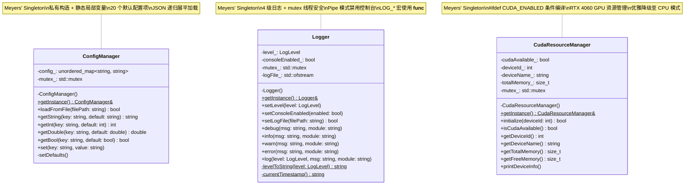
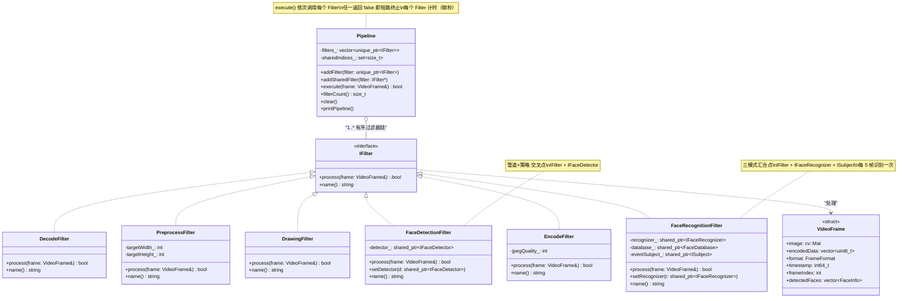
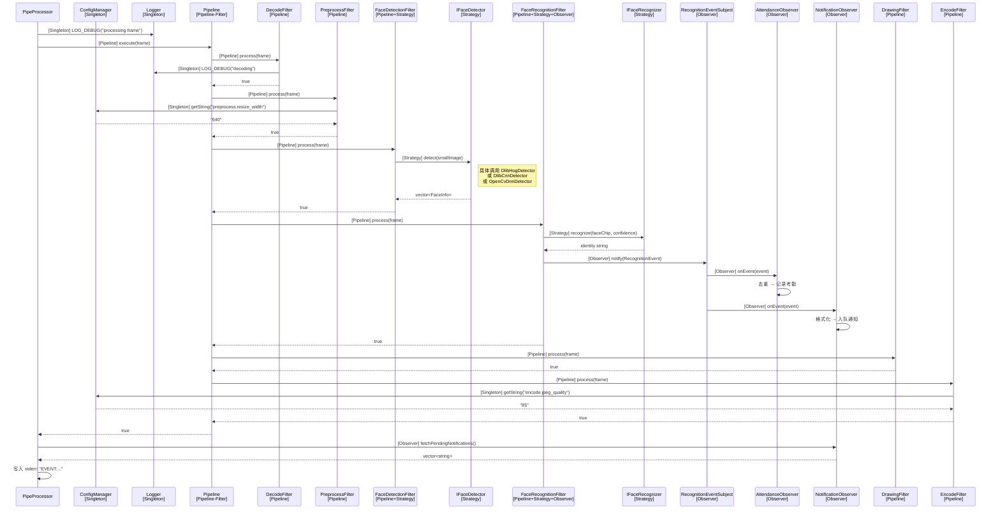
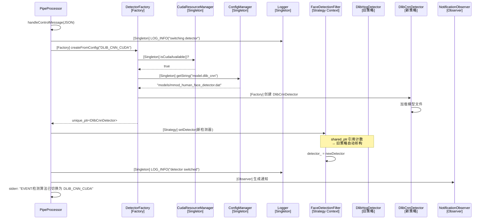

# 基于 WebRTC/OpenCV/Dlib 的智慧教室人脸跟踪识别系统——软件设计模式分析文档

---

## 摘要

本文档从**软件设计模式**维度对智慧教室人脸跟踪识别系统进行深入剖析。系统在实现过程中综合运用了五种经典设计模式：**策略模式**（双层算法解耦）、**观察者模式**（事件驱动的业务响应）、**工厂方法模式**（对象创建逻辑集中化）、**单例模式**（全局资源统一管理）以及**管道-过滤器架构模式**（视频处理流水线）。本文档逐一分析每种模式的 GoF 标准定义、在系统中的代码映射关系、UML 类图、运行时行为以及单元测试验证，并深入探讨模式之间的协作关系和设计原则映射，展现五种模式如何在一个实时视频处理系统中有机协作、相互增强。

---

## 一、引言

### 1.1 文档目的

本文档旨在为智慧教室人脸跟踪识别系统提供完整的**软件设计模式分析说明**。文档面向系统开发者、架构评审者和课程评估者，详细阐述系统中每种设计模式的应用意图、代码实现、运行时行为和工程价值。通过阅读本文档，读者可以理解各设计模式在实际工程中的落地方式，以及模式之间如何协同配合形成完整的架构体系。

本文档与《软件体系结构设计文档》（`docs/software_architecture.md`）互为补充——后者聚焦于宏观架构层面（分布式架构、通信协议、数据流等），本文档则聚焦于设计模式层面（策略、观察者、工厂、单例、管道-过滤器）。

### 1.2 系统概述

智慧教室人脸跟踪识别系统是一个基于 WebRTC、OpenCV 和 Dlib 的实时视频分析系统。C++ 后端引擎采用六级管道-过滤器架构处理视频帧，支持 3 种人脸检测算法和 2 种识别算法的运行时切换，识别事件通过观察者模式驱动考勤和通知业务，全局资源由三个单例统一管理。

### 1.3 设计模式整体应用概览

| 设计模式 | GoF 分类 | 核心接口 / 类 | 源码位置 | 应用目的 |
|---------|---------|-------------|---------|---------|
| **策略模式** | 行为型 | `IFaceDetector`、`IFaceRecognizer` | `src/vision/` | 3 种检测 + 2 种识别算法的运行时可切换 |
| **观察者模式** | 行为型 | `IObserver`、`ISubject` | `src/observer/` | 识别事件 → 考勤记录 / 前端通知的松耦合分发 |
| **工厂方法模式** | 创建型 | `DetectorFactory`、`RecognizerFactory`、`FilterFactory` | `src/vision/`、`src/pipeline/` | 封装检测器/识别器/管道的创建复杂性 |
| **单例模式** | 创建型 | `ConfigManager`、`Logger`、`CudaResourceManager` | `src/core/` | 配置/日志/CUDA 全局唯一资源管理 |
| **管道-过滤器** | 架构型 | `IFilter`、`Pipeline` | `src/pipeline/` | 6 级视频处理流水线 |

---

## 二、设计模式总览

### 2.1 五种设计模式汇总表

| 模式名称 | GoF 分类 | 设计意图 | 关键抽象接口 | 具体实现类 | 主要源文件 |
|---------|---------|---------|------------|----------|-----------|
| **策略模式** | 行为型 (Behavioral) | 定义一族算法，封装每一个，使它们可互换 | `IFaceDetector`、`IFaceRecognizer` | `DlibHogDetector`、`DlibCnnDetector`、`OpenCvDnnDetector`、`DlibFaceRecognizer`、`OpenCvLbphRecognizer` | `src/vision/IFaceDetector.h`、`src/vision/IFaceRecognizer.h`、`src/vision/detectors/*.cpp`、`src/vision/recognizers/*.cpp` |
| **观察者模式** | 行为型 (Behavioral) | 定义对象间一对多的依赖关系，当一个对象改变状态时通知所有依赖者 | `IObserver`、`ISubject` | `RecognitionEventSubject`、`AttendanceObserver`、`NotificationObserver` | `src/observer/*.h`、`src/observer/*.cpp` |
| **工厂方法模式** | 创建型 (Creational) | 定义创建对象的接口，让子类决定实例化哪一个类 | 静态工厂方法 | `DetectorFactory`、`RecognizerFactory`、`FilterFactory`、`TrackFactory` | `src/vision/DetectorFactory.cpp`、`src/vision/RecognizerFactory.cpp`、`src/pipeline/FilterFactory.cpp`、`src/network/TrackFactory.cpp` |
| **单例模式** | 创建型 (Creational) | 保证一个类仅有一个实例，并提供全局访问点 | `getInstance()` | `ConfigManager`、`Logger`、`CudaResourceManager` | `src/core/ConfigManager.h/.cpp`、`src/core/Logger.h/.cpp`、`src/core/CudaResourceManager.h/.cpp` |
| **管道-过滤器** | 架构型 (Architectural) | 将数据流处理分解为一系列独立的处理步骤，通过管道串联 | `IFilter`、`Pipeline` | `DecodeFilter`、`PreprocessFilter`、`FaceDetectionFilter`、`FaceRecognitionFilter`、`DrawingFilter`、`EncodeFilter` | `src/pipeline/IFilter.h`、`src/pipeline/Pipeline.cpp`、`src/pipeline/filters/*.cpp` |

### 2.2 模式间协作关系图



#### 协作关系说明

1. **单例 → 全体**：`ConfigManager`、`Logger`、`CudaResourceManager` 三个单例作为基础设施层，为所有其他模式提供全局服务（配置读取、日志记录、GPU 状态查询）。

2. **工厂 → 策略**：`DetectorFactory` 和 `RecognizerFactory` 负责创建策略实例。工厂封装了创建的复杂性（模型文件加载、CUDA 可用性检查、依赖注入），策略模式的客户端无需了解这些细节。

3. **策略 → 管道**：策略实例被注入到管道-过滤器中的特定过滤器——`FaceDetectionFilter` 持有 `IFaceDetector`，`FaceRecognitionFilter` 持有 `IFaceRecognizer`。管道的结构与算法的选择成为两个正交的变化维度。

4. **管道 → 观察者**：`FaceRecognitionFilter` 在识别完成后通过 `ISubject` 接口触发观察者事件，实现了计算管道与业务响应（考勤、通知）的彻底解耦。

5. **关键交叉点**：`FaceRecognitionFilter` 是三种模式（管道 + 策略 + 观察者）的汇合点——它同时实现 `IFilter` 接口（融入管道）、持有 `IFaceRecognizer`（策略委托）和 `ISubject`（事件触发），是系统中设计模式密度最高的组件。

---

## 三、策略模式 (Strategy Pattern)

### 3.1 GoF 标准定义

> **"Define a family of algorithms, encapsulate each one, and make them interchangeable. Strategy lets the algorithm vary independently from clients that use it."**
>
> ——《Design Patterns: Elements of Reusable Object-Oriented Software》(GoF, 1994)

**中文释义**：定义一族算法，将每一个算法封装起来，并使它们可以互相替换。策略模式使得算法可以独立于使用它的客户端而变化。

**核心角色**：
- **Strategy（策略接口）**：定义算法的公共接口
- **ConcreteStrategy（具体策略）**：实现具体的算法
- **Context（上下文）**：持有策略引用，将算法调用委托给策略对象

### 3.2 问题与反模式

如果不采用策略模式，检测和识别逻辑中将充斥条件分支：

```cpp
// ❌ 反模式：没有策略模式的代码
std::vector<FaceInfo> detectFaces(const cv::Mat& image, const std::string& algorithm) {
    if (algorithm == "HOG") {
        dlib::frontal_face_detector detector = dlib::get_frontal_face_detector();
        // 30 行 HOG 检测代码...
    } else if (algorithm == "CNN") {
        // 检查 CUDA 可用性
        // 加载 mmod_human_face_detector.dat
        // 50 行 CNN 检测代码...
    } else if (algorithm == "DNN") {
        // 加载 deploy.prototxt 和 caffemodel
        // 配置 CUDA 后端
        // 40 行 DNN 检测代码...
    }
    // 每新增一种算法就要修改这个函数
}
```

该反模式导致的问题：

| 代码坏味道 | 说明 |
|-----------|------|
| **过长方法** (Long Method) | 数百行代码集中在一个函数中，难以阅读和维护 |
| **违反开闭原则** (OCP Violation) | 每新增一种算法都需要修改已有的检测函数，引入回归风险 |
| **散弹式修改** (Shotgun Surgery) | 算法类型字符串散布在多处代码中 |
| **编译期耦合** | 客户端代码直接依赖所有具体算法的头文件和库 |

### 3.3 双层策略体系

本系统构成了**双层策略模式**——检测与识别是两个正交维度的算法变化点，分别由 `IFaceDetector` 和 `IFaceRecognizer` 两套策略体系独立管理。

#### 3.3.1 检测层策略

**策略接口 `IFaceDetector`**（`src/vision/IFaceDetector.h`）：

```cpp
class IFaceDetector {
public:
    virtual ~IFaceDetector() = default;
    virtual std::vector<FaceInfo> detect(const cv::Mat& frame) = 0;  // 核心检测方法
    virtual std::string getName() const = 0;                         // 算法名称
    virtual bool requiresCuda() const { return false; }              // 是否需要 CUDA
};
```

接口设计要点：
- `detect()` 接受 `cv::Mat` 引用，返回 `vector<FaceInfo>`，实现了输入输出的统一抽象
- `getName()` 用于日志记录和 UI 显示
- `requiresCuda()` 提供默认实现（`false`），仅 `DlibCnnDetector` 覆盖为 `true`——这是**接口层的硬件需求声明**，配合工厂的 CUDA 检查形成完整的硬件治理链

**具体策略 A：`DlibHogDetector`**（`src/vision/detectors/DlibHogDetector.h/.cpp`）

| 特性 | 说明 |
|------|------|
| 算法 | HOG (Histogram of Oriented Gradients) + SVM 分类器 |
| 模型 | 无需外部模型文件，使用 Dlib 内建的 `dlib::get_frontal_face_detector()` |
| 硬件 | 纯 CPU 计算 |
| 检测阈值 | `-0.5`（调整检测灵敏度） |
| 坐标转换 | `dlib::rectangle` → `BoundingBox(x, y, width, height)` |
| 适用场景 | 资源受限环境、无 GPU 环境、快速原型验证 |

**具体策略 B：`DlibCnnDetector`**（`src/vision/detectors/DlibCnnDetector.h/.cpp`）

| 特性 | 说明 |
|------|------|
| 算法 | MMOD (Max-Margin Object Detection) CNN |
| 模型 | `mmod_human_face_detector.dat`（约 700MB） |
| 硬件 | **必须 CUDA GPU**（通过 `CudaResourceManager::getInstance().isCudaAvailable()` 检查） |
| 预处理 | BGR → RGB 颜色空间转换（Dlib 要求 RGB 输入） |
| `requiresCuda()` | 返回 `true` |
| 适用场景 | 需要高检测精度的场景、有 GPU 的生产环境 |

**具体策略 C：`OpenCvDnnDetector`**（`src/vision/detectors/OpenCvDnnDetector.h/.cpp`）

| 特性 | 说明 |
|------|------|
| 算法 | SSD (Single Shot MultiBox Detector) |
| 模型 | `deploy.prototxt`（网络结构）+ `res10_300x300_ssd_iter_140000.caffemodel`（权重） |
| 硬件 | CPU 默认；可选 CUDA 后端（通过 `configureCudaBackend()` 配置 `DNN_BACKEND_CUDA` + `DNN_TARGET_CUDA`） |
| 输入预处理 | `cv::dnn::blobFromImage()`，缩放至 300×300 |
| 输出解析 | SSD 输出张量格式 `[1, 1, N, 7]`，每个检测结果 7 列：`[batch, class, confidence, x1, y1, x2, y2]`（归一化坐标），需要反归一化到原图尺寸 |
| 置信度过滤 | 低于 `detection.confidence_threshold`（默认 0.6）的检测结果被丢弃 |
| 适用场景 | 需要灵活的 CPU/GPU 切换、OpenCV 生态集成 |

#### 3.3.2 识别层策略

**策略接口 `IFaceRecognizer`**（`src/vision/IFaceRecognizer.h`）：

```cpp
class IFaceRecognizer {
public:
    virtual ~IFaceRecognizer() = default;
    virtual std::vector<float> extractFeature(const cv::Mat& faceChip) = 0; // 特征提取
    virtual std::string recognize(const cv::Mat& faceChip, float& confidence) = 0; // 身份识别
    virtual std::string getName() const = 0;
    virtual bool requiresCuda() const { return false; }
};
```

接口设计要点：
- `extractFeature()` 和 `recognize()` 分离了特征提取与身份匹配两个步骤，支持仅提取特征用于注册等场景
- `recognize()` 通过引用参数 `confidence` 返回匹配置信度
- 返回空字符串表示未识别（unknown）

**具体策略 A：`DlibFaceRecognizer`**（`src/vision/recognizers/DlibFaceRecognizer.h/.cpp`）

| 特性 | 说明 |
|------|------|
| 模型 | `shape_predictor_68_face_landmarks.dat`（68 点面部关键点）+ `dlib_face_recognition_resnet_model_v1.dat`（ResNet 特征网络） |
| 特征提取流程 | 检测 68 个面部关键点 → 对齐人脸 → 缩放至 150×150 → ResNet 前向推理 → 128 维浮点特征描述符 |
| 身份匹配 | 调用 `FaceDatabase::match(featureVector)`，计算与所有已注册人脸的**欧氏距离**，低于阈值（`recognition.distance_threshold`，默认 0.6）的最近邻为匹配结果 |
| 返回格式 | `"studentId:name"`（如 `"2024001:张三"`），未匹配返回空字符串 |
| 适用场景 | 高精度身份识别、标准的人脸注册/识别流程 |

**具体策略 B：`OpenCvLbphRecognizer`**（`src/vision/recognizers/OpenCvLbphRecognizer.h/.cpp`）

| 特性 | 说明 |
|------|------|
| 算法 | LBPH (Local Binary Pattern Histograms) |
| 参数 | `radius=1`、`neighbors=8`、`gridX=8`、`gridY=8`、`threshold=80` |
| 初始化 | `cv::face::LBPHFaceRecognizer::create(1, 8, 8, 8, 80.0)` |
| 训练要求 | 需要显式调用 `train(images, labels)` 方法，传入人脸图像和整数标签的映射 |
| `extractFeature()` | 返回空 `vector<float>`——LBPH 算法内部直方图不对外暴露 |
| `recognize()` | 调用 `recognizer_->predict(faceChip, label, confidence)`，通过标签映射表查找姓名 |
| 适用场景 | 轻量级识别、无需 GPU、小规模人脸库 |

#### 3.3.3 双层正交组合

检测和识别算法构成两个独立的策略维度，可自由组合为 $3 \times 2 = 6$ 种配置：

| | **DlibFaceRecognizer** (ResNet 128D) | **OpenCvLbphRecognizer** (LBPH) |
|---|:---:|:---:|
| **DlibHogDetector** (HOG) | HOG + ResNet | HOG + LBPH |
| **DlibCnnDetector** (CNN CUDA) | CNN + ResNet | CNN + LBPH |
| **OpenCvDnnDetector** (SSD DNN) | DNN + ResNet | DNN + LBPH |

两个策略维度**完全独立**：切换检测器不影响识别器，切换识别器不影响检测器。这种正交性通过 `FaceDetectionFilter` 和 `FaceRecognitionFilter` 分别持有各自的策略引用来保证。

### 3.4 运行时热切换完整链路

以用户将检测算法从 `DLIB_HOG` 切换为 `DLIB_CNN_CUDA` 为例，完整链路如下：

**第 1 步：前端 UI 操作**
- 用户在 `frontend/index.html` 的 `<select id="detectorSelect">` 下拉框中选择 `DLIB_CNN_CUDA`
- 点击"切换算法"按钮，触发 `switchAlgorithm()` 函数（`frontend/js/webrtc-client.js`）

**第 2 步：WebSocket 发送控制消息**
```javascript
// webrtc-client.js
function switchAlgorithm() {
    const msg = {
        type: 'switch_algorithm',
        data: {
            detector: document.getElementById('detectorSelect').value,
            recognizer: document.getElementById('recognizerSelect').value
        }
    };
    ws.send(JSON.stringify(msg));  // 文本消息
}
```

**第 3 步：Python 服务器路由控制消息**
- `server.py` 接收到文本类型的 WebSocket 消息
- 解析 JSON，识别 `type == "switch_algorithm"`
- 按哨兵协议打包：`struct.pack('>I', 0xFFFFFFFF)` + `struct.pack('>I', len(json_bytes))` + `json_bytes`
- 写入 C++ 子进程的 stdin

**第 4 步：C++ PipeProcessor 解析控制消息**
- `PipeProcessor::run()`（`src/network/PipeProcessor.cpp`）从 stdin 读取 4 字节长度
- 检测到 `0xFFFFFFFF` 哨兵值 → 转入控制消息处理分支
- 读取后续 4 字节 JSON 长度 + JSON 数据
- 调用 `handleControlMessage(jsonString)`

**第 5 步：工厂创建新策略实例**
```cpp
// PipeProcessor.cpp — handleControlMessage()
if (action == "switch_algorithm") {
    if (json.contains("detector")) {
        auto newDetector = DetectorFactory::createFromConfig(json["detector"]);
        detectionFilter_->setDetector(std::shared_ptr<IFaceDetector>(newDetector.release()));
    }
    if (json.contains("recognizer")) {
        auto newRecognizer = RecognizerFactory::createFromConfig(json["recognizer"], faceDatabase_);
        recognitionFilter_->setRecognizer(std::shared_ptr<IFaceRecognizer>(newRecognizer.release()));
    }
}
```

**第 6 步：策略注入与通知**
- `FaceDetectionFilter::setDetector()` 替换内部的 `shared_ptr<IFaceDetector>`
- 旧策略对象通过 `shared_ptr` 引用计数自动析构
- 通过 `NotificationObserver` 生成切换确认通知 → stderr `EVENT:` → Python → WebSocket → 前端弹幕

**整个过程无需重启 C++ 进程，下一帧将自动使用新的检测算法。**

### 3.5 与其他模式的协作

| 协作模式 | 协作方式 | 说明 |
|---------|---------|------|
| **工厂方法** | Factory 创建 Strategy 实例 | `DetectorFactory::createFromConfig()` 封装了创建检测器的复杂性（模型加载、CUDA 检查），策略的客户端（Filter）无需了解创建细节 |
| **管道-过滤器** | Strategy 嵌入 Filter | `FaceDetectionFilter` 实现 `IFilter` 接口融入管道，内部通过 `IFaceDetector` 委托检测算法。管道结构与算法选择成为两个正交维度 |
| **单例** | Strategy 使用 Singleton 服务 | 具体策略类（如 `DlibCnnDetector`）通过 `CudaResourceManager::getInstance()` 查询 GPU 状态，通过 `ConfigManager::getInstance()` 读取模型路径 |

**工厂负责"创建什么"，策略负责"如何使用"**——这种职责分离使得创建逻辑的变化（如新增 CUDA 检查）和算法逻辑的变化（如优化检测精度）互不影响。

### 3.6 UML 类图



### 3.7 单元测试验证

测试文件 `tests/test_strategy.cpp` 通过 4 个测试用例验证了策略模式的正确性：

**测试 1：`test_detector_polymorphism`**
- 创建 `MockDetectorA`（返回 1 张人脸）和 `MockDetectorB`（返回 2 张人脸）
- 分别调用 `detect()` 方法
- **验证**：同一接口的不同实现返回不同结果——多态分发正确

**测试 2：`test_runtime_strategy_switch`**
- 创建 `DetectorClient` 上下文对象，初始策略为 `MockDetectorA`
- 调用 `detect()` → 验证返回 1 张人脸
- 调用 `setDetector(MockDetectorB)` 切换策略
- 再次调用 `detect()` → 验证返回 2 张人脸
- **验证**：运行时策略切换无需重建上下文对象

**测试 3：`test_recognizer_polymorphism`**
- 创建 `MockRecognizerA`（返回 `"StudentA"`）和 `MockRecognizerB`（返回 `"StudentB"`）
- 分别调用 `recognize()` 和 `extractFeature()`
- **验证**：识别结果正确，特征向量维度为 128

**测试 4：`test_dual_strategy_independence`**
- 同时持有一个检测器策略和一个识别器策略
- 独立切换检测器（A→B）→ 验证识别器不受影响
- 独立切换识别器（A→B）→ 验证检测器不受影响
- **验证**：双层策略完全正交，互不干扰

---

## 四、观察者模式 (Observer Pattern)

### 4.1 GoF 标准定义

> **"Define a one-to-many dependency between objects so that when one object changes state, all its dependents are notified and updated automatically."**
>
> ——《Design Patterns: Elements of Reusable Object-Oriented Software》(GoF, 1994)

**中文释义**：定义对象间的一种一对多的依赖关系，当一个对象的状态发生改变时，所有依赖于它的对象都得到通知并自动更新。

**核心角色**：
- **Subject（主题/被观察者）**：维护观察者列表，提供注册/注销/通知方法
- **Observer（观察者）**：定义接收通知的回调接口
- **ConcreteSubject（具体主题）**：存储状态，状态变化时通知观察者
- **ConcreteObserver（具体观察者）**：实现回调，执行具体的响应逻辑

### 4.2 问题与反模式

如果不采用观察者模式，识别完成后的业务响应逻辑将直接耦合在识别代码中：

```cpp
// ❌ 反模式：识别完成后直接调用各业务模块
void FaceRecognitionFilter::process(VideoFrame& frame) {
    // ... 识别逻辑 ...
    if (identified) {
        attendanceLogger.record(student);     // 强依赖考勤模块
        notificationService.send(student);    // 强依赖通知模块
        securityAlarm.check(student);         // 强依赖安防模块
        parentNotifier.notify(student);       // 强依赖家长通知模块
        statisticsCollector.count(student);   // 强依赖统计模块
    }
}
```

该反模式导致的问题：

| 代码坏味道 | 说明 |
|-----------|------|
| **过大的类** (Large Class) | 识别 Filter 承担了识别 + 考勤 + 通知 + 安防 + 统计等多种职责 |
| **违反开闭原则** (OCP Violation) | 每新增一种业务响应都需要修改识别代码 |
| **紧耦合** | 识别模块与所有业务模块产生编译期依赖 |
| **违反单一职责** (SRP Violation) | 识别 Filter 的修改原因过多 |

### 4.3 代码映射关系

**抽象主题接口 `ISubject`**（`src/observer/ISubject.h`）：

```cpp
class ISubject {
public:
    virtual ~ISubject() = default;
    virtual void attach(std::shared_ptr<IObserver> observer) = 0;
    virtual void detach(std::shared_ptr<IObserver> observer) = 0;
    virtual void notify(const RecognitionEvent& event) = 0;
};
```

**抽象观察者接口 `IObserver`**（`src/observer/IObserver.h`）：

```cpp
class IObserver {
public:
    virtual ~IObserver() = default;
    virtual void onEvent(const RecognitionEvent& event) = 0;
    virtual std::string getObserverName() const = 0;
};
```

**具体主题 `RecognitionEventSubject`**（`src/observer/RecognitionEventSubject.h/.cpp`）：
- 管理 `vector<shared_ptr<IObserver>> observers_`
- `attach()` 方法检查重复（避免同一观察者注册两次）
- `notify()` 方法遍历观察者列表，逐一调用 `onEvent()`，每个调用包装在 `try-catch` 中确保异常安全

**事件数据结构 `RecognitionEvent`**（`src/core/Types.h`）：

```cpp
struct RecognitionEvent {
    RecognitionEventType type;      // 事件类型
    FaceInfo faceInfo;              // 人脸信息（位置、身份、置信度）
    int64_t timestamp = 0;          // 时间戳（毫秒）
    std::string message;            // 描述消息
};

enum class RecognitionEventType {
    FACE_DETECTED,     // 检测到人脸（未进行识别）
    FACE_IDENTIFIED,   // 成功识别身份
    FACE_UNKNOWN       // 检测到未注册人脸
};
```

### 4.4 具体观察者详析

#### 4.4.1 AttendanceObserver

**源文件**：`src/observer/AttendanceObserver.h/.cpp`

**职责**：监听 `FACE_IDENTIFIED` 事件，记录学生考勤信息。

**关键实现细节**：

| 特性 | 实现方式 |
|------|---------|
| **事件过滤** | `if (event.type != RecognitionEventType::FACE_IDENTIFIED) return;` — 仅处理身份识别成功的事件，忽略 `FACE_DETECTED` 和 `FACE_UNKNOWN` |
| **去重机制** | 使用 `unordered_set<string> checkedIn_` 存储已签到的身份标识。同一个学生在一次会话中只记录一次考勤 |
| **日志格式** | `[CHECK-IN] 2024-01-15 14:30:25 | 2024001:张三 | confidence: 0.85` |
| **持久化** | 追加写入构造时指定的日志文件路径（如 `attendance.log`） |
| **线程安全** | `mutex_` 保护 `checkedIn_` 集合和文件写入操作 |
| **查询接口** | `getCheckedInStudents()` 返回已签到学生集合的拷贝 |

#### 4.4.2 NotificationObserver

**源文件**：`src/observer/NotificationObserver.h/.cpp`

**职责**：监听所有类型的识别事件，将通知消息入队供外部系统消费。

**关键实现细节**：

| 特性 | 实现方式 |
|------|---------|
| **事件范围** | 处理**所有**事件类型（`FACE_DETECTED`、`FACE_IDENTIFIED`、`FACE_UNKNOWN`） |
| **消息队列** | 使用 `queue<string> notifications_` 存储待推送的通知消息字符串 |
| **消费接口** | `fetchPendingNotifications()` 方法锁定 mutex，将队列中所有消息取出到 `vector<string>` 中返回（drain 模式），队列清空 |
| **计数接口** | `pendingCount()` 返回当前队列长度 |
| **线程安全** | `mutex_` 保护队列的入队和出队操作 |
| **消费者** | `PipeProcessor::flushNotifications()` 在每帧处理后调用 `fetchPendingNotifications()`，将消息以 `EVENT:消息内容\n` 格式写入 `STDERR_FILENO` |

### 4.5 事件触发与分发完整流程

完整的事件从产生到最终用户可见的全链路：

1. **触发**：`FaceRecognitionFilter::process()` 完成一张人脸的识别后，调用私有方法 `emitRecognitionEvent(faceInfo, timestamp)`
2. **构造事件**：`emitRecognitionEvent()` 根据识别结果构造 `RecognitionEvent` 结构体，设置事件类型（`IDENTIFIED` / `UNKNOWN`）、人脸信息、时间戳和描述消息
3. **通知主题**：调用 `eventSubject_->notify(event)`
4. **遍历观察者**：`RecognitionEventSubject::notify()` 锁定 `mutex_`，遍历 `observers_` 列表
5. **异常安全调用**：对每个观察者执行 `try { observer->onEvent(event); } catch (const std::exception& e) { LOG_WARN(...); }`
6. **考勤记录**：`AttendanceObserver::onEvent()` 检查事件类型为 `FACE_IDENTIFIED` → 检查 `checkedIn_` 去重 → 追加日志文件
7. **通知入队**：`NotificationObserver::onEvent()` 格式化消息字符串 → 推入 `notifications_` 队列
8. **管道返回**：`pipeline_->execute()` 完成
9. **通知刷新**：`PipeProcessor::flushNotifications()` 调用 `notificationObserver_->fetchPendingNotifications()` 取出所有待发送通知
10. **写入 stderr**：逐条以 `EVENT:消息内容\n` 格式写入 `STDERR_FILENO`
11. **Python 读取**：`server.py` 的 `read_backend_events()` 后台协程从 stderr 逐行读取，检测 `EVENT:` 前缀
12. **WebSocket 广播**：构造 JSON `{"type":"notification","data":{"message":"..."}}` 并通过 WebSocket 文本消息广播
13. **前端渲染**：`ui.js` 的 `addNotification(data)` 在通知面板顶部插入通知条目

### 4.6 线程安全设计

观察者模式的三个核心组件均采用了 `std::mutex` 保障线程安全：

| 组件 | mutex 保护范围 | 说明 |
|------|-------------|------|
| `RecognitionEventSubject` | `attach()`、`detach()`、`notify()` | 防止并发的注册/注销与通知遍历冲突 |
| `AttendanceObserver` | `onEvent()` 中的 `checkedIn_` 修改和文件写入 | 防止并发事件导致的集合/文件竞争 |
| `NotificationObserver` | `onEvent()` 的入队和 `fetchPendingNotifications()` 的出队 | 防止生产者-消费者竞争 |

**异常安全**：`RecognitionEventSubject::notify()` 使用 per-observer 的 `try-catch`，确保一个观察者的异常不会阻止其他观察者接收事件：

```cpp
void RecognitionEventSubject::notify(const RecognitionEvent& event) {
    std::lock_guard<std::mutex> lock(mutex_);
    for (auto& observer : observers_) {
        try {
            observer->onEvent(event);
        } catch (const std::exception& e) {
            LOG_WARN("Observer '" + observer->getObserverName() + "' threw: " + e.what());
        }
    }
}
```

**无死锁风险**：每个类使用独立的 mutex，不存在嵌套锁定。调用链 `notify() → onEvent()` 中，`RecognitionEventSubject` 的 mutex 在调用 `onEvent()` 时已持有，但 `AttendanceObserver` 和 `NotificationObserver` 使用各自独立的 mutex，不会产生死锁。

### 4.7 UML 类图



### 4.8 单元测试验证

测试文件 `tests/test_observer.cpp` 通过 5 个测试用例验证了观察者模式的正确性：

**测试 1：`test_attach_detach`**
- 创建 `RecognitionEventSubject`，attach 两个 `MockObserver`
- 验证 `observerCount() == 2`
- 再次 attach 相同的观察者（测试去重）→ 验证 `observerCount()` 仍为 2
- detach 一个 → 验证 `observerCount() == 1`
- **验证**：注册去重和注销正确工作

**测试 2：`test_notify_all`**
- 注册 3 个 `MockObserver`，发送一个 `FACE_IDENTIFIED` 事件
- **验证**：3 个观察者均收到事件，事件数据（identity、type）正确

**测试 3：`test_selective_observation`**
- 注册一个 `MockObserver`（接收所有事件）和一个 `IdentifiedOnlyObserver`（仅接收 `FACE_IDENTIFIED`）
- 发送 `FACE_UNKNOWN` 事件
- **验证**：`MockObserver` 收到事件，`IdentifiedOnlyObserver` 未收到（选择性过滤正确）

**测试 4：`test_detach_stops_notification`**
- 注册观察者 → 发送事件 → 验证收到
- detach 观察者 → 发送新事件 → 验证未收到
- **验证**：注销后不再接收通知

**测试 5：`test_multiple_events`**
- 注册一个 `MockObserver`，连续发送 5 个不同身份的 `FACE_IDENTIFIED` 事件
- **验证**：观察者记录的最后一个事件的 identity 与第 5 个事件匹配

---

## 五、工厂方法模式 (Factory Method Pattern)

### 5.1 GoF 标准定义

> **"Define an interface for creating an object, but let subclasses decide which class to instantiate. Factory Method lets a class defer instantiation to subclasses."**
>
> ——《Design Patterns: Elements of Reusable Object-Oriented Software》(GoF, 1994)

**中文释义**：定义一个用于创建对象的接口，让子类决定实例化哪一个类。工厂方法使一个类的实例化延迟到其子类。

**本系统的变体**：系统采用的是**静态工厂方法**（Static Factory Method）变体——通过静态方法而非子类来决定创建哪种产品，这在 C++ 实践中更为常见。

### 5.2 问题与反模式

如果在客户端代码中直接创建检测器对象：

```cpp
// ❌ 反模式：客户端直接 new 具体类
void initializeDetector(const std::string& type) {
    if (type == "DLIB_CNN_CUDA") {
        // 需要检查 CUDA 可用性
        if (!CudaResourceManager::getInstance().isCudaAvailable()) {
            LOG_WARN("CUDA not available, falling back to HOG");
            detector = std::make_unique<DlibHogDetector>();
        } else {
            auto cnnDetector = std::make_unique<DlibCnnDetector>();
            // 需要知道模型路径
            std::string modelPath = ConfigManager::getInstance().getString("model.dlib_cnn");
            // 需要知道初始化参数...
            detector = std::move(cnnDetector);
        }
    } else if (type == "OPENCV_DNN") {
        // 需要加载两个模型文件
        std::string configPath = ConfigManager::getInstance().getString("model.opencv_dnn_config");
        std::string weightsPath = ConfigManager::getInstance().getString("model.opencv_dnn_weights");
        auto dnnDetector = std::make_unique<OpenCvDnnDetector>();
        // ... 配置 CUDA 后端 ...
    }
    // 若多处需要创建检测器，以上代码被重复
}
```

| 代码坏味道 | 说明 |
|-----------|------|
| **过长方法** (Long Method) | 创建逻辑与业务逻辑混杂在一起 |
| **重复代码** (Duplicated Code) | 若 `main.cpp` 和 `PipeProcessor` 都需要创建检测器，初始化代码被重复 |
| **特性依恋** (Feature Envy) | 客户端代码过度了解具体类的内部构造细节 |
| **编译期硬依赖** | 客户端必须 `#include` 所有具体检测器的头文件 |

### 5.3 四个工厂类详析

#### 5.3.1 DetectorFactory

**源文件**：`src/vision/DetectorFactory.h/.cpp`

```cpp
class DetectorFactory {
public:
    static std::unique_ptr<IFaceDetector> create(DetectorType type);
    static std::unique_ptr<IFaceDetector> createFromConfig(const std::string& typeName);
};
```

**`create(DetectorType)` 方法逻辑**：

| 输入类型 | 创建逻辑 | 返回 |
|---------|---------|------|
| `DLIB_HOG` | 直接创建 | `make_unique<DlibHogDetector>()` |
| `DLIB_CNN_CUDA` | 检查 `CudaResourceManager::getInstance().isCudaAvailable()`：若可用则创建 `DlibCnnDetector`；**若不可用则降级**，日志警告并返回 `DlibHogDetector` | `DlibCnnDetector` 或降级 `DlibHogDetector` |
| `OPENCV_DNN` | 直接创建 | `make_unique<OpenCvDnnDetector>()` |
| 未知类型 | 日志警告，返回安全默认值 | `make_unique<DlibHogDetector>()` |

**`createFromConfig(string)` 方法**：将字符串映射到枚举——`"DLIB_HOG"` → `DetectorType::DLIB_HOG`，`"DLIB_CNN_CUDA"` → `DetectorType::DLIB_CNN_CUDA`，`"OPENCV_DNN"` → `DetectorType::OPENCV_DNN`，未知字符串映射到 `DLIB_HOG` 并记录警告。

#### 5.3.2 RecognizerFactory

**源文件**：`src/vision/RecognizerFactory.h/.cpp`

```cpp
class RecognizerFactory {
public:
    static std::unique_ptr<IFaceRecognizer> create(RecognizerType type,
                                                    std::shared_ptr<FaceDatabase> database);
    static std::unique_ptr<IFaceRecognizer> createFromConfig(const std::string& typeName,
                                                              std::shared_ptr<FaceDatabase> database);
};
```

**关键设计**：`FaceDatabase` 作为依赖通过工厂方法注入到识别器中。客户端无需知道哪些识别器需要 `FaceDatabase`——所有识别器都通过工厂统一接收这个依赖。

| 输入类型 | 创建逻辑 | 返回 |
|---------|---------|------|
| `DLIB_RESNET` | 注入 `FaceDatabase` | `make_unique<DlibFaceRecognizer>(database)` |
| `OPENCV_LBPH` | 注入 `FaceDatabase` | `make_unique<OpenCvLbphRecognizer>(database)` |
| 未知类型 | 默认创建 | `make_unique<DlibFaceRecognizer>(database)` |

#### 5.3.3 FilterFactory

**源文件**：`src/pipeline/FilterFactory.h/.cpp`

```cpp
class FilterFactory {
public:
    static std::unique_ptr<IFilter> createFilter(FilterType type, /* ... */);
    static std::unique_ptr<Pipeline> createDefaultPipeline(
        std::shared_ptr<IFaceDetector> detector,
        std::shared_ptr<IFaceRecognizer> recognizer,
        std::shared_ptr<FaceDatabase> database,
        std::shared_ptr<ISubject> eventSubject);
};
```

**`createFilter(FilterType)`**：根据 `FilterType` 枚举创建对应的过滤器实例。

**`createDefaultPipeline()`**：一键组装完整的六级管道：
1. 创建 `Pipeline` 对象
2. 依次添加 `DecodeFilter`、`PreprocessFilter`（独占所有权）
3. 创建 `FaceDetectionFilter`、`FaceRecognitionFilter`（共享所有权，用于运行时算法切换）
4. 添加 `DrawingFilter`、`EncodeFilter`（独占所有权）
5. 调用 `printPipeline()` 输出管道结构日志

#### 5.3.4 TrackFactory

**源文件**：`src/network/TrackFactory.h/.cpp`

WebRTC 媒体轨道的工厂骨架，为未来集成 `libdatachannel` 库预留接口：

```cpp
class TrackFactory {
public:
    static std::shared_ptr<void> createVideoTrack(const TrackConfig& config);
    static std::shared_ptr<void> createDataChannel(const std::string& label);
};
```

当前实现返回 `nullptr`，源码中包含注释掉的 `libdatachannel` API 调用，展示了预期的实现方式。

### 5.4 工厂与策略模式的协作

在运行时算法切换场景中，工厂方法与策略模式紧密协作：

```
PipeProcessor::handleControlMessage("DLIB_CNN_CUDA")
    │
    ├── [工厂] DetectorFactory::createFromConfig("DLIB_CNN_CUDA")
    │       ├── 检查 CUDA 可用性（CudaResourceManager 单例）
    │       ├── 加载模型文件（ConfigManager 单例提供路径）
    │       └── 返回 unique_ptr<DlibCnnDetector>
    │
    └── [策略] FaceDetectionFilter::setDetector(新检测器)
            └── 替换 shared_ptr<IFaceDetector>，下一帧使用新算法
```

**职责分离**：
- **工厂负责"创建什么"**：封装了对象创建的全部复杂性（模型加载、CUDA 检查、默认降级）
- **策略负责"如何使用"**：`FaceDetectionFilter` 不关心检测器是如何创建的，只关心调用 `detect()` 方法

### 5.5 CUDA 可用性检查的工厂级保障

系统对 CUDA 硬件需求形成了**三层治理体系**：

| 层次 | 组件 | 职责 | 实现 |
|------|------|------|------|
| **接口声明层** | `IFaceDetector::requiresCuda()` | 在接口层声明硬件需求 | `DlibCnnDetector` 覆盖为 `true`，其他保持默认 `false` |
| **工厂检查层** | `DetectorFactory::create()` | 在创建时验证硬件可用性 | 创建 `DLIB_CNN_CUDA` 前检查 `CudaResourceManager`，不可用则降级 |
| **资源管理层** | `CudaResourceManager` 单例 | 集中管理 GPU 状态 | 提供 `isCudaAvailable()`、`getDeviceId()`、`getFreeMemory()` 等查询 |

**优雅降级**：当用户请求 `DLIB_CNN_CUDA` 但 CUDA 不可用时，`DetectorFactory` 自动创建 `DlibHogDetector` 并记录警告日志，而非抛出异常或创建不可用的对象。这确保了系统在任何硬件环境下都能正常运行。

### 5.6 UML 类图

```mermaid
classDiagram
    class DetectorFactory {
        +create(type: DetectorType) unique_ptr~IFaceDetector~$
        +createFromConfig(typeName: string) unique_ptr~IFaceDetector~$
    }

    class RecognizerFactory {
        +create(type: RecognizerType, db: shared_ptr~FaceDatabase~) unique_ptr~IFaceRecognizer~$
        +createFromConfig(typeName: string, db: shared_ptr~FaceDatabase~) unique_ptr~IFaceRecognizer~$
    }

    class FilterFactory {
        +createFilter(type: FilterType, ...) unique_ptr~IFilter~$
        +createDefaultPipeline(...) unique_ptr~Pipeline~$
    }

    class TrackFactory {
        +createVideoTrack(config: TrackConfig) shared_ptr~void~$
        +createDataChannel(label: string) shared_ptr~void~$
    }

    class IFaceDetector {
        <<interface>>
    }
    class IFaceRecognizer {
        <<interface>>
    }
    class IFilter {
        <<interface>>
    }

    class DlibHogDetector
    class DlibCnnDetector
    class OpenCvDnnDetector
    class DlibFaceRecognizer
    class OpenCvLbphRecognizer
    class Pipeline

    DetectorFactory ..> IFaceDetector : "创建"
    DetectorFactory ..> DlibHogDetector : "实例化"
    DetectorFactory ..> DlibCnnDetector : "实例化"
    DetectorFactory ..> OpenCvDnnDetector : "实例化"

    RecognizerFactory ..> IFaceRecognizer : "创建"
    RecognizerFactory ..> DlibFaceRecognizer : "实例化"
    RecognizerFactory ..> OpenCvLbphRecognizer : "实例化"

    FilterFactory ..> IFilter : "创建"
    FilterFactory ..> Pipeline : "组装"

    DetectorFactory --> CudaResourceManager : "检查 CUDA"
```



---

## 六、单例模式 (Singleton Pattern)

### 6.1 GoF 标准定义

> **"Ensure a class only has one instance, and provide a global point of access to it."**
>
> ——《Design Patterns: Elements of Reusable Object-Oriented Software》(GoF, 1994)

**中文释义**：保证一个类仅有一个实例，并提供一个访问它的全局访问点。

**适用条件**：当类在逻辑上只能有一个实例（如系统配置、日志系统、硬件资源管理器），且需要从多处访问时。

### 6.2 问题与反模式

系统中三个单例类分别解决了不同的代码坏味道：

| 单例类 | 不使用单例时的问题 | 代码坏味道 |
|--------|-----------------|-----------|
| `ConfigManager` | 各模块自行读取和解析 `config.json`，修改一个配置项需要在多处同步更新 | **散弹式修改** (Shotgun Surgery) |
| `Logger` | 各模块自行管理日志输出——有的写文件、有的写控制台、格式不统一 | **发散式变化** (Divergent Change) |
| `CudaResourceManager` | 多个模块分别初始化 CUDA 设备，重复代码且可能产生资源冲突 | **重复代码** (Duplicated Code) |

### 6.3 三个单例类详析

#### 6.3.1 ConfigManager

**源文件**：`src/core/ConfigManager.h/.cpp`

**核心职责**：集中管理系统的所有配置参数，提供线程安全的读写接口。

**私有构造与禁止拷贝/移动**：

```cpp
class ConfigManager {
public:
    static ConfigManager& getInstance() {
        static ConfigManager instance;   // Meyers' Singleton
        return instance;
    }
    ConfigManager(const ConfigManager&) = delete;
    ConfigManager& operator=(const ConfigManager&) = delete;
    ConfigManager(ConfigManager&&) = delete;
    ConfigManager& operator=(ConfigManager&&) = delete;
private:
    ConfigManager();  // 私有构造
};
```

**默认配置项（20 项）**：

| 键 | 默认值 | 用途 |
|----|--------|------|
| `detector.type` | `"DLIB_HOG"` | 默认检测算法 |
| `recognizer.type` | `"DLIB_RESNET"` | 默认识别算法 |
| `detection.confidence_threshold` | `"0.6"` | 检测置信度阈值 |
| `recognition.distance_threshold` | `"0.6"` | 识别距离阈值 |
| `model.dlib_cnn` | `"models/mmod_human_face_detector.dat"` | CNN 模型路径 |
| `model.shape_predictor` | `"models/shape_predictor_68_face_landmarks.dat"` | 关键点模型路径 |
| `model.dlib_resnet` | `"models/dlib_face_recognition_resnet_model_v1.dat"` | ResNet 模型路径 |
| `model.opencv_dnn_config` | `"models/deploy.prototxt"` | DNN 配置路径 |
| `model.opencv_dnn_weights` | `"models/res10_300x300_ssd_iter_140000.caffemodel"` | DNN 权重路径 |
| `database.face_db_path` | `"data/face_database.json"` | 人脸库路径 |
| `cuda.device_id` | `"0"` | CUDA 设备 ID |
| `cuda.enabled` | `"true"` | 是否启用 CUDA |
| `preprocess.resize_width` | `"640"` | 预处理目标宽度 |
| `preprocess.resize_height` | `"480"` | 预处理目标高度 |
| `encode.format` | `"JPEG"` | 编码格式 |
| `encode.jpeg_quality` | `"85"` | JPEG 质量 |
| `webrtc.stun_server` | `"stun:stun.l.google.com:19302"` | STUN 服务器 |
| `signaling.ws_port` | `"8765"` | WebSocket 端口 |
| `log.level` | `"INFO"` | 日志级别 |
| `log.file` | `"smart_classroom.log"` | 日志文件路径 |

**JSON 递归展平算法**：

`loadFromFile()` 使用 nlohmann::json 解析 `config.json`，通过递归 lambda 函数 `flatten` 将嵌套 JSON 对象展平为点分隔的键值对：

```
输入 JSON:                         展平结果:
{                                   "detector.type" = "DLIB_HOG"
  "detector": {                     "cuda.device_id" = "0"
    "type": "DLIB_HOG"              "cuda.enabled" = "true"
  },                                ...
  "cuda": {
    "device_id": "0",
    "enabled": "true"
  }
}
```

**线程安全**：所有公开方法（`getString`、`getInt`、`getDouble`、`getBool`、`set`）均通过 `std::lock_guard<std::mutex>` 保护，支持多线程安全访问。

**类型安全的 Getter**：`getInt()` 内部使用 `std::stoi()` + `try-catch`，解析失败时返回默认值而非抛出异常。`getBool()` 接受 `"true"`、`"1"`、`"yes"` 三种真值表示。

#### 6.3.2 Logger

**源文件**：`src/core/Logger.h/.cpp`

**核心职责**：提供统一的日志系统，支持多级别、多输出目标、线程安全的日志记录。

**四个日志级别**：

| 级别 | 枚举值 | 输出目标 | 用途 |
|------|:-----:|---------|------|
| `DEBUG` | 0 | stdout | 详细调试信息（管道执行时间、Filter 状态） |
| `INFO` | 1 | stdout | 一般运行信息（初始化完成、算法切换） |
| `WARN` | 2 | stdout | 警告信息（CUDA 不可用、配置文件缺失） |
| `ERROR` | 3 | **stderr** | 错误信息（初始化失败、处理异常） |

**Pipe 模式的静默设计**：在 `--pipe-mode` 下，`main.cpp` 调用 `logger.setConsoleEnabled(false)` 禁用控制台输出——因为 stdout 和 stderr 分别用于帧数据协议和事件通知协议，日志输出到控制台会破坏二进制协议。日志仍然写入文件（`smart_classroom.log`）。

**便捷宏定义**：

```cpp
#define LOG_DEBUG(msg) smart_classroom::Logger::getInstance().debug(msg, __func__)
#define LOG_INFO(msg)  smart_classroom::Logger::getInstance().info(msg, __func__)
#define LOG_WARN(msg)  smart_classroom::Logger::getInstance().warn(msg, __func__)
#define LOG_ERROR(msg) smart_classroom::Logger::getInstance().error(msg, __func__)
```

使用 `__func__` 自动捕获调用者的函数名作为 module 参数，无需手动传入。

**时间戳格式**：`[2024-01-15 14:30:25.123]` — 使用 `chrono::system_clock` 获取当前时间，精确到毫秒。

**线程安全**：`log()` 方法使用 `std::lock_guard<std::mutex>` 保护格式化、控制台输出和文件写入的完整过程，确保多线程环境下日志行不会交错。

#### 6.3.3 CudaResourceManager

**源文件**：`src/core/CudaResourceManager.h/.cpp`

**核心职责**：集中管理 NVIDIA CUDA GPU 资源，为系统中所有需要 GPU 的组件提供统一的设备状态查询接口。

**条件编译**：整个 CUDA 初始化逻辑包裹在 `#ifdef CUDA_ENABLED` 预编译指令中。当 CMake 的 `ENABLE_CUDA` 选项为 `OFF`（或未找到 CUDA Toolkit）时，所有 CUDA API 调用被跳过，`initialize()` 返回 `false` 并记录警告。

```cpp
bool CudaResourceManager::initialize(int deviceId) {
    std::lock_guard<std::mutex> lock(mutex_);
#ifdef CUDA_ENABLED
    int deviceCount = 0;
    cudaError_t err = cudaGetDeviceCount(&deviceCount);
    if (err != cudaSuccess || deviceCount == 0) {
        LOG_WARN("No CUDA devices found, falling back to CPU mode");
        cudaAvailable_ = false;
        return false;
    }
    // ... cudaSetDevice, cudaGetDeviceProperties ...
    cudaAvailable_ = true;
    return true;
#else
    LOG_WARN("CUDA support not compiled, running in CPU-only mode");
    cudaAvailable_ = false;
    return false;
#endif
}
```

**初始化流程**：`cudaGetDeviceCount()` → 验证 `deviceId` 合法性 → `cudaSetDevice()` → `cudaGetDeviceProperties()` 获取设备名称和显存信息

**查询接口**：

| 方法 | 返回值 | 说明 |
|------|--------|------|
| `isCudaAvailable()` | `bool` | 是否成功初始化 CUDA |
| `getDeviceId()` | `int` | 当前 CUDA 设备 ID |
| `getDeviceName()` | `string` | GPU 名称（如 "NVIDIA GeForce RTX 4060"） |
| `getTotalMemory()` | `size_t` | GPU 总显存（字节） |
| `getFreeMemory()` | `size_t` | GPU 当前可用显存（通过 `cudaMemGetInfo` 实时查询） |

### 6.4 Meyers' Singleton 的 C++11 线程安全原理

三个单例均采用 **Meyers' Singleton** 实现模式：

```cpp
static ConfigManager& getInstance() {
    static ConfigManager instance;  // 局部静态变量
    return instance;
}
```

**C++11 标准保证**（ISO C++11 §6.7 [stmt.dcl] p4）：

> *"If control enters the declaration concurrently while the variable is being initialized, the concurrent execution shall wait for completion of the initialization."*

即：如果多个线程同时首次调用 `getInstance()`，C++11 标准保证局部静态变量的初始化只会执行一次，其他线程会等待初始化完成后再获取引用。编译器会自动插入隐式的 guard 变量和同步机制来实现这一保证。

**优于其他单例实现方式**：

| 实现方式 | 问题 | Meyers' Singleton 的优势 |
|---------|------|------------------------|
| **饿汉式**（全局静态变量） | 无论是否使用都会初始化；跨编译单元的初始化顺序不确定（Static Initialization Order Fiasco） | 惰性初始化，首次使用时才构造 |
| **双重检查锁** (DCLP) | pre-C++11 容易出错（需要 `volatile`/`atomic`），代码复杂 | 无需手写同步代码 |
| **显式 mutex 保护** | 每次 `getInstance()` 都有锁开销 | 初始化后无锁开销 |

**禁止拷贝和移动**：三个单例均通过 `= delete` 明确禁止拷贝构造、拷贝赋值、移动构造和移动赋值，防止意外创建副本。

### 6.5 初始化顺序依赖分析

在 `main.cpp` 的 Phase 1 中，三个单例按严格顺序初始化：

```
Logger → ConfigManager → CudaResourceManager
```

**依赖关系**：

| 顺序 | 单例 | 依赖说明 |
|:---:|------|---------|
| 1 | **Logger** | 无依赖。最先初始化，因为后续所有初始化步骤都需要日志记录 |
| 2 | **ConfigManager** | 依赖 Logger（`loadFromFile()` 失败时记录警告）。需要在 CudaResourceManager 之前初始化，因为后者需要读取 `cuda.device_id` 配置 |
| 3 | **CudaResourceManager** | 依赖 Logger（日志记录）和 ConfigManager（读取 `cuda.device_id`、`cuda.enabled`） |

**无循环依赖**：依赖关系是严格单向的，不存在循环引用。Meyers' Singleton 的惰性初始化特性保证了即使在不按顺序调用 `getInstance()` 的场景下也能正确工作，但 `main.cpp` 中的显式顺序使依赖关系更加清晰和可维护。

### 6.6 UML 类图



---

## 七、管道-过滤器架构模式 (Pipeline-Filter Architectural Pattern)

### 7.1 模式定义

> **"The Pipes and Filters architectural pattern provides a structure for systems that process a stream of data. Each processing step is encapsulated in a filter component. Data is passed through pipes between adjacent filters."**
>
> ——《Pattern-Oriented Software Architecture (POSA)》Vol. 1

**中文释义**：管道-过滤器架构模式为处理数据流的系统提供了一种结构。每个处理步骤被封装在一个过滤器组件中，数据通过管道在相邻的过滤器之间传递。

**核心概念**：
- **Filter（过滤器）**：独立的处理步骤，接收输入数据、处理、产生输出数据
- **Pipe（管道）**：连接两个相邻过滤器的数据通道
- **Data Source（数据源）**：数据的起点
- **Data Sink（数据汇）**：数据的终点

### 7.2 问题与反模式

如果将所有视频帧处理逻辑写在一个大函数中：

```cpp
// ❌ 反模式：单体函数处理
VideoFrame processFrame(const uint8_t* data, size_t size) {
    // 解码（50行）
    cv::Mat img = cv::imdecode(cv::Mat(1, size, CV_8UC1, (void*)data), cv::IMREAD_COLOR);

    // 预处理（30行）
    cv::resize(img, img, cv::Size(640, 480));

    // 检测（80行）
    auto faces = hogDetector.detect(img);
    // 或者 cnnDetector.detect(img) — 需要 if-else 切换

    // 识别（100行）
    for (auto& face : faces) {
        recognizer.identify(img, face);
        // 考勤记录、通知推送...
    }

    // 绘制（40行）
    for (auto& face : faces) {
        cv::rectangle(img, face.bbox.toCvRect(), ...);
    }

    // 编码（20行）
    cv::imencode(".jpg", img, buffer);
    return frame;
}
```

| 代码坏味道 | 说明 |
|-----------|------|
| **过长方法** (Long Method) | 数百行代码集中在一个函数中 |
| **发散式变化** (Divergent Change) | 修改任何一个处理步骤都要改动同一个函数 |
| **极低的可测试性** | 无法对单个处理步骤进行单元测试 |
| **无法灵活重组** | 无法跳过某个步骤（如调试时跳过绘制）或插入新步骤 |

### 7.3 Pipeline 执行机制

**`execute(VideoFrame& frame)` 方法**：

```cpp
bool Pipeline::execute(VideoFrame& frame) {
    for (size_t i = 0; i < filters_.size(); ++i) {
        auto startTime = std::chrono::steady_clock::now();
        bool success = filters_[i]->process(frame);
        auto elapsed = std::chrono::duration_cast<std::chrono::microseconds>(
            std::chrono::steady_clock::now() - startTime).count();

        LOG_DEBUG("filter '" + filters_[i]->name() + "' took " + std::to_string(elapsed) + " us");

        if (!success) {
            LOG_WARN("filter '" + filters_[i]->name() + "' failed, aborting pipeline");
            return false;  // 短路终止
        }
    }
    return true;
}
```

**关键特性**：

| 特性 | 实现 | 价值 |
|------|------|------|
| **顺序执行** | `for` 循环遍历 `filters_` 向量 | 保证处理步骤的确定性顺序 |
| **短路机制** | 任一 Filter 返回 `false` → 立即 `return false` | 避免无效计算（如解码失败后无需检测） |
| **性能计时** | `chrono::steady_clock` 微秒级计时 | 便于识别性能瓶颈 |
| **日志追踪** | 记录每个 Filter 的名称、耗时和结果 | 便于调试和性能分析 |

**所有权模型**：

| 方法 | 所有权语义 | 析构行为 | 使用场景 |
|------|-----------|---------|---------|
| `addFilter(unique_ptr<IFilter>)` | Pipeline **独占**所有权 | 正常析构 | DecodeFilter、PreprocessFilter、DrawingFilter、EncodeFilter |
| `addSharedFilter(IFilter*)` | Pipeline **共享**所有权 | `release()` 避免 double-free | FaceDetectionFilter、FaceRecognitionFilter（外部需要引用以调用 `setDetector()`/`setRecognizer()`） |

`addSharedFilter()` 将裸指针包装为 `unique_ptr` 以统一管道内的访问方式，但将其索引记录到 `sharedIndices_` 集合中。析构时，对 `sharedIndices_` 中的索引调用 `release()` 释放所有权而不析构对象。

### 7.4 六个具体过滤器详析

| # | Filter 类 | 源文件 | 读取字段 | 写入字段 | 关键依赖 | 核心逻辑 |
|---|-----------|--------|---------|---------|---------|---------|
| 1 | `DecodeFilter` | `src/pipeline/filters/DecodeFilter.cpp` | `encodedData`、`format` | `image`、`format` | OpenCV | `cv::imdecode()` JPEG 解码；RAW 格式直接通过 |
| 2 | `PreprocessFilter` | `src/pipeline/filters/PreprocessFilter.cpp` | `image` | `image` | ConfigManager | `cv::resize()` 缩放至 640×480；RGB→BGR 转换 |
| 3 | `FaceDetectionFilter` | `src/pipeline/filters/FaceDetectionFilter.cpp` | `image` | `detectedFaces` | `IFaceDetector`（策略） | 降采样至 320px → `detect()` → 坐标映射回原图 |
| 4 | `FaceRecognitionFilter` | `src/pipeline/filters/FaceRecognitionFilter.cpp` | `image`、`detectedFaces`、`frameIndex` | `detectedFaces[].identity` | `IFaceRecognizer`（策略）、`FaceDatabase`、`ISubject`（观察者） | 每 5 帧完整识别；触发 `emitRecognitionEvent()` |
| 5 | `DrawingFilter` | `src/pipeline/filters/DrawingFilter.cpp` | `image`、`detectedFaces` | `image` | OpenCV | 绿框+姓名（已识别）/ 红框+"Unknown"（未知）+ 置信度 % |
| 6 | `EncodeFilter` | `src/pipeline/filters/EncodeFilter.cpp` | `image` | `encodedData`、`format` | ConfigManager、OpenCV | `cv::imencode(".jpg")` 编码，质量由配置决定 |

### 7.5 VideoFrame 数据流分析

以下表格展示 `VideoFrame` 各字段在管道中的逐步变化：

| 字段 | 初始状态（PipeProcessor 构建） | ① Decode | ② Preprocess | ③ Detection | ④ Recognition | ⑤ Drawing | ⑥ Encode |
|------|:---:|:---:|:---:|:---:|:---:|:---:|:---:|
| `encodedData` | JPEG 字节流 | **清空** | — | — | — | — | **重新填充** |
| `image` | 空 `cv::Mat` | **生成** BGR Mat | **缩放** 640×480 | 不变 | 不变 | **叠加标注** | 不变 |
| `format` | `ENCODED_JPEG` | → `RAW_BGR` | 不变 | 不变 | 不变 | 不变 | → `ENCODED_JPEG` |
| `detectedFaces` | 空 `vector` | — | — | **填充** bbox+confidence | **填充** identity+distance | **读取**绘制 | — |
| `timestamp` | 当前时间 | 不变 | 不变 | 不变 | 不变 | 不变 | 不变 |
| `frameIndex` | 递增序号 | 不变 | 不变 | 不变 | **读取**节流判断 | 不变 | 不变 |

### 7.6 FaceDetectionFilter 作为管道与策略的交叉点

`FaceDetectionFilter` 是**管道-过滤器模式**与**策略模式**的交叉点——对外它是 Pipeline 中的第 3 级过滤器（实现 `IFilter` 接口），对内它将实际的检测算法委托给可替换的 `IFaceDetector` 策略：

| 维度 | 接口 | 角色 | 说明 |
|------|------|------|------|
| **管道维度** | `IFilter` | 过滤器 | 实现 `process(VideoFrame&)`，融入 Pipeline 的顺序执行链 |
| **策略维度** | `IFaceDetector` | 上下文 | 通过 `shared_ptr<IFaceDetector> detector_` 持有策略引用，委托 `detect()` 调用 |

**解耦效果**：
- **Pipeline 不知道使用了哪种检测器**：Pipeline 只调用 `process()`，不关心内部使用 HOG 还是 CNN
- **Detector 不知道自己在管道中**：检测器只接收 `cv::Mat` 并返回 `vector<FaceInfo>`，不依赖 Pipeline 或 VideoFrame
- **`setDetector()` 实现运行时切换**：替换 `detector_` 指针即可切换算法，无需修改 Pipeline 结构

### 7.7 FaceRecognitionFilter 作为三种模式的汇合点

`FaceRecognitionFilter` 是整个系统中**设计模式密度最高**的组件，同时融合了三种模式：

| 模式 | 接口/角色 | 持有的引用 | 职责 |
|------|---------|-----------|------|
| **管道-过滤器** | `IFilter` / 第 4 级过滤器 | — | 实现 `process(VideoFrame&)`，融入管道顺序执行 |
| **策略** | `IFaceRecognizer` 的上下文 | `shared_ptr<IFaceRecognizer> recognizer_` | 委托识别算法的具体执行 |
| **观察者** | 事件源 | `shared_ptr<ISubject> eventSubject_` | 识别完成后触发 `notify()` 通知所有观察者 |

**额外的优化设计**：

- **识别节流**：`RECOGNIZE_EVERY_N_FRAMES = 5`，每 5 帧执行一次完整识别。通过 `frameIndex % 5 == 0` 判断当前帧是否需要执行识别。中间帧复用上次识别的 identity 缓存，避免不必要的识别计算
- **依赖注入**：`FaceDatabase` 通过构造函数注入，用于识别结果的身份匹配

**三种模式如何自然组合**：

```
Pipeline 调用 → process(frame)
                   │
                   ├── [策略] recognizer_->recognize(faceChip, confidence)
                   │       └── FaceDatabase::match() → identity
                   │
                   └── [观察者] emitRecognitionEvent(faceInfo, timestamp)
                           └── eventSubject_->notify(event)
                                   ├── AttendanceObserver::onEvent()
                                   └── NotificationObserver::onEvent()
```

### 7.8 UML 类图



### 7.9 单元测试验证

测试文件 `tests/test_pipeline.cpp` 通过 5 个测试用例验证了管道-过滤器模式的正确性：

**测试 1：`test_empty_pipeline`**
- 创建空 Pipeline（无 Filter），调用 `execute()`
- **验证**：返回 `true`——空管道不处理任何数据，视为成功
- **意义**：确认管道的边界条件处理正确

**测试 2：`test_single_filter`**
- 创建 Pipeline，添加一个 `MockFilter`（记录调用到 `vector<string>& log`）
- 调用 `execute()`
- **验证**：`log` 中恰好包含一条记录，Filter 被调用且仅调用一次

**测试 3：`test_pipeline_order`**
- 创建 Pipeline，按序添加 6 个 `MockFilter`（名称 F1~F6），共享同一个 `log` 向量
- 调用 `execute()`
- **验证**：`log` 中记录顺序为 `["F1", "F2", "F3", "F4", "F5", "F6"]`——严格按添加顺序执行
- **意义**：管道-过滤器模式的核心保证——处理步骤的有序性

**测试 4：`test_pipeline_short_circuit`**
- 创建 Pipeline：F1（返回 true）→ F2（返回 **false**）→ F3（返回 true）
- 调用 `execute()`
- **验证**：`execute()` 返回 `false`；`log` 包含 `["F1", "F2"]`，**F3 未被调用**
- **意义**：验证短路机制——失败的 Filter 终止后续处理

**测试 5：`test_pipeline_filter_count`**
- 添加 3 个 Filter → 验证 `filterCount() == 3`
- 调用 `clear()` → 验证 `filterCount() == 0`
- 再添加 2 个 Filter → 验证 `filterCount() == 2`
- **意义**：管道的动态管理能力

---

## 八、模式协作时序图

### 8.1 一帧处理中的五种模式协作

以下时序图展示了在处理一帧视频的过程中，五种设计模式如何协同工作：



### 8.2 算法切换中的模式协作

以下时序图展示了运行时算法切换过程中，工厂方法、策略、单例和观察者模式的协同：



---

## 九、设计原则映射

### 9.1 开闭原则 (Open/Closed Principle — OCP)

> 软件实体应该对扩展开放，对修改关闭。

| 应用场景 | OCP 体现 | 扩展方式 | 需要修改的已有代码 |
|---------|---------|---------|-----------------|
| **策略模式** | 新增检测/识别算法 | 实现 `IFaceDetector` / `IFaceRecognizer` 接口 | 仅需在 `DetectorFactory` / `RecognizerFactory` 添加一个 case |
| **观察者模式** | 新增业务响应 | 实现 `IObserver` 接口并 `attach()` | **零修改**——`FaceRecognitionFilter` 和 `RecognitionEventSubject` 完全不变 |
| **管道-过滤器** | 新增处理步骤 | 实现 `IFilter` 接口 | 仅需在 Pipeline 组装处添加一行 `addFilter()` |

### 9.2 单一职责原则 (Single Responsibility Principle — SRP)

> 一个类应该只有一个引起变化的原因。

| 组件 | 单一职责 | 变化原因 |
|------|---------|---------|
| `DecodeFilter` | 帧解码 | 编码格式变化（如新增 H.265） |
| `PreprocessFilter` | 图像预处理 | 预处理算法变化（如新增直方图均衡） |
| `FaceDetectionFilter` | 人脸检测（委托） | 检测策略接口变化 |
| `FaceRecognitionFilter` | 身份识别（委托 + 事件触发） | 识别策略接口或事件接口变化 |
| `DrawingFilter` | 结果可视化 | 绘制样式变化（如修改颜色、字体） |
| `EncodeFilter` | 帧编码 | 编码格式或质量变化 |
| `AttendanceObserver` | 考勤记录 | 考勤规则变化（如去重策略） |
| `NotificationObserver` | 通知排队 | 通知格式或排队策略变化 |
| `ConfigManager` | 配置管理 | 配置格式或存储方式变化 |
| `Logger` | 日志记录 | 日志格式或输出目标变化 |
| `CudaResourceManager` | GPU 资源管理 | GPU 管理策略变化 |

### 9.3 依赖倒置原则 (Dependency Inversion Principle — DIP)

> 高层模块不应依赖低层模块，二者都应依赖抽象。抽象不应依赖细节，细节应依赖抽象。

系统中 4 个关键抽象接口实现了依赖倒置：

| 抽象接口 | 高层模块（依赖抽象） | 低层模块（实现抽象） |
|---------|-------------------|-------------------|
| `IFaceDetector` | `FaceDetectionFilter` | `DlibHogDetector`、`DlibCnnDetector`、`OpenCvDnnDetector` |
| `IFaceRecognizer` | `FaceRecognitionFilter` | `DlibFaceRecognizer`、`OpenCvLbphRecognizer` |
| `IFilter` | `Pipeline` | 6 个具体 Filter |
| `IObserver` / `ISubject` | `FaceRecognitionFilter`（事件源） | `AttendanceObserver`、`NotificationObserver` |

**依赖方向**：所有高层模块（Pipeline、Filters、PipeProcessor）仅依赖抽象接口，不直接引用具体实现类。具体实现类的创建由工厂方法封装，通过依赖注入（构造函数参数或 setter 方法）传入。

### 9.4 接口隔离原则 (Interface Segregation Principle — ISP)

> 客户端不应被强迫依赖它不使用的方法。

| 接口 | 方法数 | 设计考量 |
|------|:-----:|---------|
| `IFilter` | 2 | `process()` + `name()`——管道只需要这两个操作 |
| `IObserver` | 2 | `onEvent()` + `getObserverName()`——事件系统只需要回调和标识 |
| `IFaceDetector` | 3 | `detect()` + `getName()` + `requiresCuda()`——聚焦检测能力，`requiresCuda()` 有默认实现 |
| `IFaceRecognizer` | 4 | `extractFeature()` + `recognize()` + `getName()` + `requiresCuda()`——聚焦识别能力 |
| `ISubject` | 3 | `attach()` + `detach()` + `notify()`——标准观察者主题接口 |

所有接口都保持了最小化设计，没有强迫客户端实现不需要的方法。`requiresCuda()` 在 `IFaceDetector` 和 `IFaceRecognizer` 中提供了默认实现（`return false`），只有真正需要 CUDA 的实现类才需要覆盖。

### 9.5 里氏替换原则 (Liskov Substitution Principle — LSP)

> 子类型必须能够替换其基类型。

单元测试提供了 LSP 的直接验证证据：

| 测试 | LSP 验证内容 |
|------|------------|
| `test_detector_polymorphism` | `MockDetectorA` 和 `MockDetectorB` 均可替代 `IFaceDetector` 使用，返回不同结果但接口行为一致 |
| `test_recognizer_polymorphism` | `MockRecognizerA` 和 `MockRecognizerB` 均可替代 `IFaceRecognizer` 使用 |
| `test_runtime_strategy_switch` | `DetectorClient` 在运行时切换策略实例，前后行为均正确——替换不破坏客户端代码 |
| `test_pipeline_order` | 6 个 `MockFilter` 均可替代 `IFilter` 使用，Pipeline 的执行行为不受具体 Filter 类型影响 |
| `test_notify_all` | 3 个 `MockObserver` 均可替代 `IObserver` 使用，`RecognitionEventSubject` 的通知行为不受具体 Observer 类型影响 |
| `test_selective_observation` | `IdentifiedOnlyObserver` 替代 `IObserver` 使用，通过内部过滤实现选择性观察——行为差异在接口契约允许的范围内 |

---

## 十、总结

### 五种模式的协作体系

本系统的五种设计模式形成了一个层次化的协作体系：

```
单例模式 (Infrastructure)
    ↓ 提供全局服务
工厂方法模式 (Creation)
    ↓ 创建算法实例
策略模式 (Algorithm)
    ↓ 嵌入处理管道
管道-过滤器模式 (Processing)
    ↓ 触发业务事件
观察者模式 (Events)
```

- **单例**作为地基，提供配置、日志和 GPU 资源管理
- **工厂**基于单例提供的配置信息，创建合适的算法实例
- **策略**将工厂创建的算法实例封装为可替换的策略对象
- **管道**将策略嵌入有序的处理流水线，对每帧视频执行端到端处理
- **观察者**将管道中产生的识别事件松耦合地分发给各业务响应模块

### 工程价值

| 设计原则 | 对应模式 | 工程价值 |
|---------|---------|---------|
| **开闭原则** (OCP) | 策略 + 观察者 + 管道 | 新增算法/业务/处理步骤无需修改已有代码 |
| **单一职责** (SRP) | 管道中的 6 个 Filter + 2 个 Observer + 3 个 Singleton | 每个组件聚焦单一任务，修改原因唯一 |
| **依赖倒置** (DIP) | 4 个抽象接口 | 高层模块依赖抽象而非实现，支持编译期解耦和运行时替换 |
| **接口隔离** (ISP) | 最小化接口设计 | 客户端不被强迫依赖不需要的方法 |
| **里氏替换** (LSP) | 全部策略/过滤器/观察者 | 14 个单元测试验证了替换的正确性 |

### 模式交叉点的设计亮点

`FaceRecognitionFilter` 作为**管道-过滤器 + 策略 + 观察者**三种模式的汇合点，展现了设计模式在实际工程中的自然组合方式：它不是为了展示模式而人为拼凑，而是因为视频处理管道中的身份识别步骤天然需要——可替换的算法（策略）、有序的处理位置（管道）和松耦合的业务响应（观察者）。这种**需求驱动**的模式应用，正是设计模式在工程实践中的最高价值所在。
