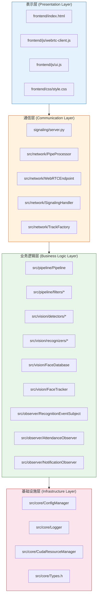
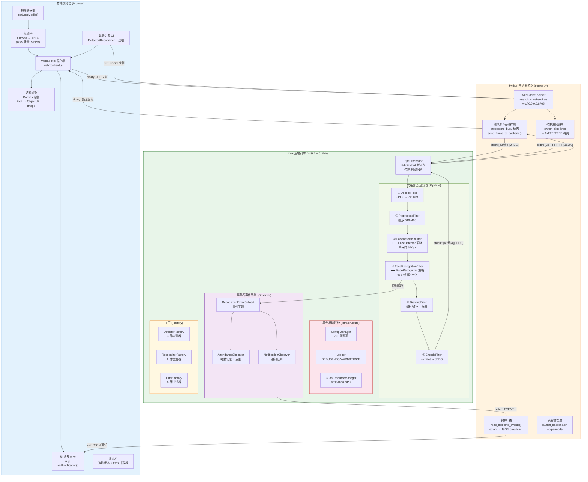
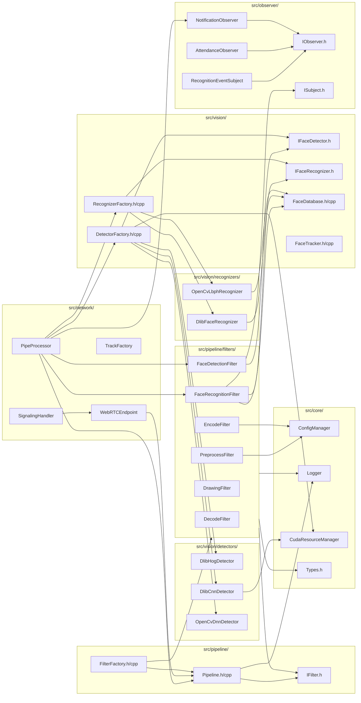
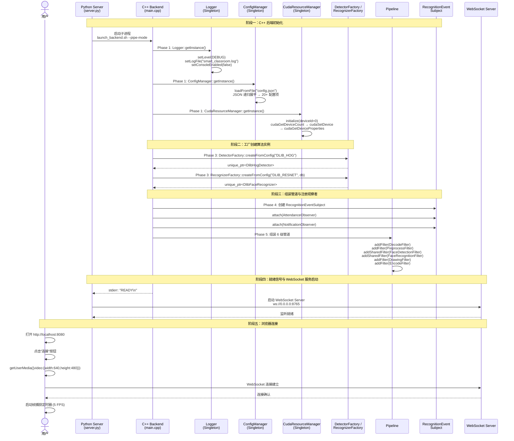
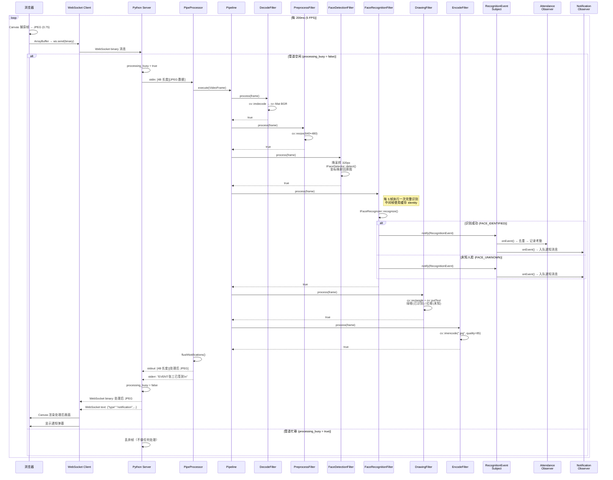
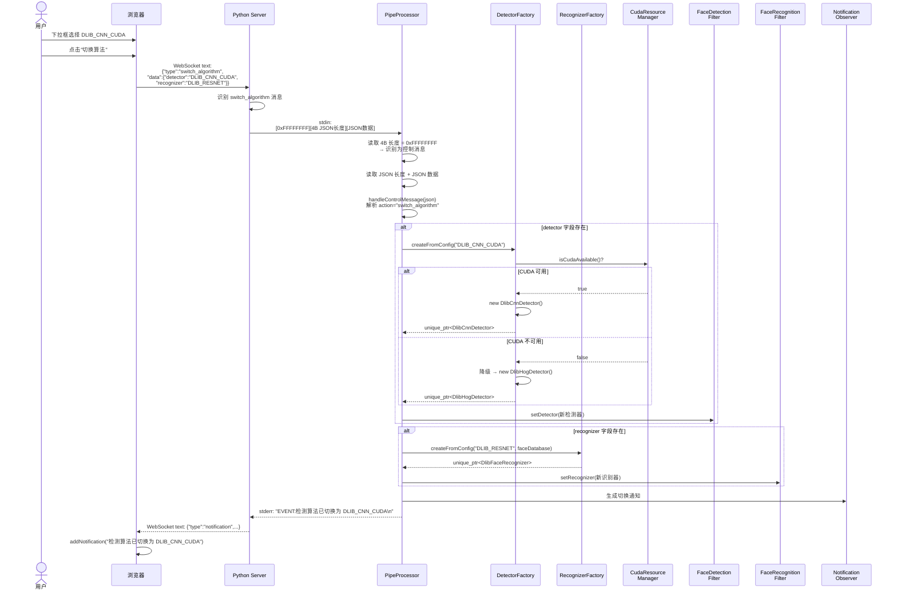
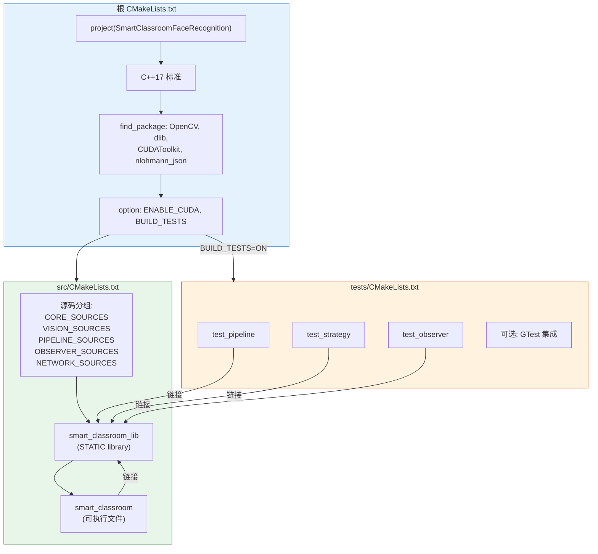

# 基于 WebRTC/OpenCV/Dlib 的智慧教室人脸跟踪识别系统——软件体系结构设计文档

---

## 摘要

本文档从**软件体系结构**维度对智慧教室人脸跟踪识别系统进行深入剖析。系统采用 B/S 分布式架构，前端浏览器通过 WebSocket 协议与 Python 中继服务器通信，Python 服务器通过 stdin/stdout 管道与 C++ 后端引擎交互。后端引擎采用六级管道-过滤器（Pipeline-Filter）架构风格，依次完成帧解码、预处理、人脸检测、身份识别、标注绘制和编码回传。本文档从架构风格分析、系统架构图、进程间通信协议、帧生命周期、数据流时序图、质量属性保障、构建系统架构和技术栈汇总等十个维度，全面阐述系统的体系结构设计决策与工程实现。

---

## 一、引言

### 1.1 文档目的

本文档旨在为智慧教室人脸跟踪识别系统提供完整的**软件体系结构设计说明**。文档面向系统开发者、架构评审者和课程评估者，详细阐述系统在架构层面的设计决策、通信协议、数据流转路径、质量属性保障机制以及构建系统组织方式。通过阅读本文档，读者可以全面理解系统的宏观架构设计及其背后的工程考量。

本文档与《软件设计模式分析文档》（`docs/design_patterns.md`）互为补充——后者聚焦于设计模式层面的分析，本文档则聚焦于体系结构层面的分析。

### 1.2 系统概述

智慧教室人脸跟踪识别系统是一个基于 WebRTC、OpenCV 和 Dlib 的实时视频分析系统，主要应用于教室场景下的学生考勤与身份识别。系统的核心特性包括：

- **实时视频处理**：以 5 FPS 的帧率从浏览器摄像头采集视频，经后端处理后实时回传标注结果
- **多算法支持**：支持 3 种人脸检测算法（Dlib HOG、Dlib CNN CUDA、OpenCV DNN）和 2 种识别算法（Dlib ResNet 128D、OpenCV LBPH），共 6 种组合
- **运行时算法切换**：用户可通过前端 UI 在运行时动态切换检测/识别算法，无需重启后端
- **GPU 加速**：支持 NVIDIA CUDA GPU（RTX 4060）加速推理
- **事件驱动业务**：识别事件通过观察者模式驱动考勤记录和前端通知
- **零客户端部署**：基于浏览器的 B/S 架构，无需安装客户端软件

### 1.3 术语表

| 术语 | 全称 | 说明 |
|------|------|------|
| WebRTC | Web Real-Time Communication | 浏览器实时通信技术，本系统使用其媒体采集 API |
| OpenCV | Open Source Computer Vision Library | 开源计算机视觉库，用于图像处理和 DNN 推理 |
| Dlib | Dlib C++ Library | C++ 机器学习库，用于人脸检测和特征提取 |
| CUDA | Compute Unified Device Architecture | NVIDIA GPU 并行计算平台 |
| cuDNN | CUDA Deep Neural Network Library | NVIDIA 深度学习加速库 |
| Pipeline-Filter | 管道-过滤器 | 软件体系结构风格，数据流经一系列处理步骤 |
| WebSocket | — | 全双工通信协议，建立在 TCP 之上 |
| STUN | Session Traversal Utilities for NAT | NAT 穿透工具，用于 WebRTC 连接建立 |
| SDP | Session Description Protocol | 会话描述协议，用于 WebRTC 媒体协商 |
| ICE | Interactive Connectivity Establishment | 交互式连接建立，WebRTC 连接框架 |
| HOG | Histogram of Oriented Gradients | 方向梯度直方图，传统人脸检测算法 |
| CNN | Convolutional Neural Network | 卷积神经网络 |
| MMOD | Max-Margin Object Detection | 最大间隔目标检测，Dlib 的 CNN 检测架构 |
| SSD | Single Shot MultiBox Detector | 单次多框检测器，OpenCV DNN 使用的检测架构 |
| DNN | Deep Neural Network | 深度神经网络 |
| LBPH | Local Binary Pattern Histograms | 局部二值模式直方图，人脸识别算法 |
| ResNet | Residual Network | 残差网络，用于人脸特征提取 |
| IoU | Intersection over Union | 交并比，用于目标跟踪匹配 |
| JPEG | Joint Photographic Experts Group | 图像压缩格式 |
| BGR | Blue-Green-Red | OpenCV 默认的颜色通道顺序 |
| FPS | Frames Per Second | 每秒帧数 |
| WSL2 | Windows Subsystem for Linux 2 | Windows 下的 Linux 子系统 |
| Meyers' Singleton | — | 基于 C++11 局部静态变量的单例实现方式 |
| Pipe Mode | 管道模式 | C++ 后端通过 stdin/stdout 与 Python 通信的工作模式 |
| B/S 架构 | Browser/Server | 浏览器/服务器架构 |

---

## 二、架构风格分析

本系统融合了四种核心软件体系结构风格，各风格在系统中承担不同的职责并协同工作。

### 2.1 B/S 分布式架构

#### 三进程分析

系统在运行时由三个独立的进程组成，形成了经典的 B/S 分布式架构：

| 进程 | 技术实现 | 运行环境 | 核心职责 |
|------|---------|---------|---------|
| **浏览器进程** | HTML5 + JavaScript | 用户浏览器（Chrome/Firefox/Edge） | 视频采集、帧编码、结果渲染、用户交互、算法切换 UI |
| **Python 中继服务器** | Python 3 + asyncio + websockets | WSL2 Ubuntu | WebSocket 服务、子进程管理、帧转发与丢帧控制、控制消息路由、事件广播 |
| **C++ 后端引擎** | C++17 + OpenCV + Dlib | WSL2 Ubuntu (CUDA) | 帧解码、图像预处理、人脸检测、身份识别、结果标注、帧编码、事件生成 |

#### 进程间通信机制

```
浏览器 ◄──WebSocket (binary/text)──► Python 服务器 ◄──stdin/stdout/stderr (pipe)──► C++ 引擎
```

- **浏览器 ↔ Python**：基于 WebSocket 协议（`ws://localhost:8765`），支持二进制消息（JPEG 帧数据）和文本消息（JSON 控制指令与事件通知）
- **Python ↔ C++**：基于 Unix 管道（stdin/stdout/stderr），Python 以父进程身份启动 C++ 子进程，通过 stdin 发送帧数据和控制消息，通过 stdout 接收处理结果，通过 stderr 接收事件通知

#### 架构优势

1. **零客户端部署**：用户只需浏览器即可使用系统，无需安装任何客户端软件
2. **跨平台访问**：任何支持 WebSocket 的现代浏览器均可作为客户端
3. **计算卸载**：计算密集型的视频处理逻辑完全在服务端执行，客户端仅负责采集和渲染
4. **独立部署**：前端和后端可以分别部署在不同的主机上，通过网络通信
5. **技术栈隔离**：前端使用 JavaScript，后端使用 C++，各自选择最适合的技术栈

### 2.2 前后端分离架构

#### 物理隔离

前端代码（`frontend/` 目录）与后端代码（`src/` 目录）在文件系统中完全隔离，二者之间不存在任何编译期依赖关系。前端通过 WebSocket 协议与后端交互，数据格式通过约定（而非共享代码）来保证一致性。

```
项目根目录
├── frontend/                  ← 前端代码（纯静态资源）
│   ├── index.html             ← 主页面
│   ├── js/webrtc-client.js    ← WebSocket 客户端 + 帧捕获
│   ├── js/ui.js               ← UI 交互逻辑
│   └── css/style.css          ← 样式表
│
├── src/                       ← C++ 后端代码
│   ├── core/                  ← 基础设施（单例）
│   ├── pipeline/              ← 管道-过滤器
│   ├── vision/                ← 检测/识别算法
│   ├── observer/              ← 观察者事件系统
│   ├── network/               ← 网络/管道通信
│   └── main.cpp               ← 入口
│
└── signaling/server.py        ← Python 中继服务器
```

#### WebSocket 消息格式

前端与 Python 服务器之间通过 WebSocket 交换两种类型的消息：

| 方向 | 消息类型 | 格式 | 用途 | 示例 |
|------|---------|------|------|------|
| 上行（Browser→Server） | 二进制 | JPEG 字节流 | 发送摄像头捕获的视频帧 | `ArrayBuffer(JPEG data)` |
| 下行（Server→Browser） | 二进制 | JPEG 字节流 | 回传处理后的标注帧 | `ArrayBuffer(processed JPEG)` |
| 上行（Browser→Server） | 文本 | JSON 字符串 | 发送算法切换指令 | `{"type":"switch_algorithm","data":{"detector":"DLIB_CNN_CUDA","recognizer":"DLIB_RESNET"}}` |
| 下行（Server→Browser） | 文本 | JSON 字符串 | 推送识别事件通知 | `{"type":"notification","data":{"message":"张三已签到"}}` |

### 2.3 管道-过滤器 (Pipe-and-Filter) 架构

管道-过滤器是后端 C++ 引擎的**核心架构风格**，将复杂的视频帧处理逻辑分解为六个职责单一的处理步骤。

#### IFilter 接口分析

```cpp
// src/pipeline/IFilter.h
class IFilter {
public:
    virtual ~IFilter() = default;
    virtual bool process(VideoFrame& frame) = 0;  // 处理一帧，返回是否成功
    virtual std::string name() const = 0;          // 返回过滤器名称（用于日志）
};
```

接口设计遵循**最小接口原则**：仅定义 `process()` 和 `name()` 两个纯虚方法。`process()` 接受 `VideoFrame` 引用，对其进行就地修改（in-place mutation），返回 `bool` 表示处理是否成功。

#### Pipeline 编排器分析

```cpp
// src/pipeline/Pipeline.h
class Pipeline {
public:
    void addFilter(std::unique_ptr<IFilter> filter);   // 添加独占所有权的过滤器
    void addSharedFilter(IFilter* filter);              // 添加共享所有权的过滤器
    bool execute(VideoFrame& frame);                    // 执行管道
    size_t filterCount() const;                         // 查询过滤器数量
    void clear();                                       // 清空管道
    void printPipeline() const;                         // 打印管道结构
private:
    std::vector<std::unique_ptr<IFilter>> filters_;     // 有序过滤器链
    std::set<size_t> sharedIndices_;                    // 共享过滤器的索引集
};
```

关键设计决策：

1. **双重所有权模型**：`addFilter()` 接受 `unique_ptr`，Pipeline 拥有完整所有权；`addSharedFilter()` 接受裸指针并包装为 `unique_ptr`，但记录其索引到 `sharedIndices_`，析构时通过 `release()` 避免 double-free。这允许 `FaceDetectionFilter` 和 `FaceRecognitionFilter` 同时被 Pipeline 和 `PipeProcessor` 引用（后者需要调用 `setDetector()`/`setRecognizer()` 进行运行时策略切换）。

2. **顺序执行与短路机制**：`execute()` 方法依次调用每个 Filter 的 `process()` 方法。若任一 Filter 返回 `false`，立即终止后续处理并返回 `false`，避免无效计算。

3. **性能计时**：`execute()` 内部对每个 Filter 使用 `chrono::steady_clock` 计时，以微秒精度记录每个处理步骤的耗时，便于性能分析和瓶颈定位。

#### VideoFrame 数据流对象——逐字段分析

`VideoFrame` 结构体是管道中流转的核心数据对象，各 Filter 在处理过程中逐步填充和转换其字段：

| 字段 | 类型 | DecodeFilter | PreprocessFilter | FaceDetectionFilter | FaceRecognitionFilter | DrawingFilter | EncodeFilter |
|------|------|:---:|:---:|:---:|:---:|:---:|:---:|
| `encodedData` | `vector<uint8_t>` | **R**（读取 JPEG） | — | — | — | — | **W**（写入处理后 JPEG） |
| `image` | `cv::Mat` | **W**（解码生成） | **RW**（缩放） | **R**（检测输入） | **R**（识别输入） | **RW**（绘制标注） | **R**（编码输入） |
| `format` | `FrameFormat` | **W**（→RAW_BGR） | — | — | — | — | **W**（→ENCODED_JPEG） |
| `detectedFaces` | `vector<FaceInfo>` | — | — | **W**（填充检测结果） | **RW**（填充 identity） | **R**（读取绘制） | — |
| `timestamp` | `int64_t` | — | — | — | — | — | — |
| `frameIndex` | `int` | — | — | — | **R**（节流判断） | — | — |

> **R** = 读取，**W** = 写入，**RW** = 读写，**—** = 不涉及

#### 六级过滤器详表

| 阶段 | Filter 类 | 源文件 | 输入 | 处理逻辑 | 输出 | 关键依赖 |
|:---:|-----------|--------|------|---------|------|---------|
| 1 | `DecodeFilter` | `src/pipeline/filters/DecodeFilter.cpp` | `encodedData`（JPEG 字节流） | `cv::imdecode()` 解码；RAW_BGR/RAW_RGB 直接通过；H.264/VP8 为桩实现 | `image`（cv::Mat BGR） | OpenCV |
| 2 | `PreprocessFilter` | `src/pipeline/filters/PreprocessFilter.cpp` | `image`（原始尺寸） | 从 ConfigManager 读取目标尺寸（默认 640×480），`cv::resize()` 缩放（INTER_LINEAR），RGB→BGR 颜色空间转换 | `image`（归一化尺寸） | ConfigManager |
| 3 | `FaceDetectionFilter` | `src/pipeline/filters/FaceDetectionFilter.cpp` | `image`（预处理后） | 委托 `IFaceDetector` 策略执行检测；先将图像缩放至最大 320px（降低检测计算量），检测后将边界框坐标映射回原图尺寸 | `detectedFaces[]`（位置+置信度） | IFaceDetector（策略） |
| 4 | `FaceRecognitionFilter` | `src/pipeline/filters/FaceRecognitionFilter.cpp` | `image` + `detectedFaces[]` | 委托 `IFaceRecognizer` 策略执行识别；每 5 帧执行一次完整识别（`RECOGNIZE_EVERY_N_FRAMES=5`），中间帧使用缓存的 identity；识别完成后触发观察者事件 | `detectedFaces[].identity` 填充 | IFaceRecognizer（策略）、FaceDatabase、ISubject（观察者） |
| 5 | `DrawingFilter` | `src/pipeline/filters/DrawingFilter.cpp` | `image` + `detectedFaces[]` | 遍历检测结果：已识别人脸绘制**绿色**边界框+姓名标签+置信度百分比；未识别人脸绘制**红色**边界框+"Unknown" 标签 | `image`（叠加标注） | OpenCV |
| 6 | `EncodeFilter` | `src/pipeline/filters/EncodeFilter.cpp` | `image`（标注后） | 从 ConfigManager 读取编码格式（默认 JPEG）和质量（默认 85），调用 `cv::imencode()` 编码；H.264/VP8 为桩实现 | `encodedData`（JPEG 字节流） | ConfigManager、OpenCV |

### 2.4 分层架构 (Layered Architecture)

从逻辑视角看，系统的 C++ 后端代码和整体架构可以划分为四个层次：



#### 各层职责与依赖约束

| 层次 | 职责 | 源码目录 | 依赖规则 |
|------|------|---------|---------|
| **表示层** | 视频采集、帧编码/渲染、用户交互、通知展示 | `frontend/` | 仅依赖通信层（通过 WebSocket） |
| **通信层** | WebSocket 服务、进程管理、帧转发、控制消息路由、管道 I/O | `signaling/server.py` + `src/network/` | 依赖业务逻辑层（调用 Pipeline）和基础设施层（使用 Logger） |
| **业务逻辑层** | 视频处理管道、人脸检测/识别算法、事件分发、考勤/通知 | `src/pipeline/` + `src/vision/` + `src/observer/` | 依赖基础设施层（使用 ConfigManager、Logger、CudaResourceManager） |
| **基础设施层** | 全局配置管理、日志系统、CUDA 资源管理、公共类型定义 | `src/core/` | 无上层依赖，被所有其他层使用 |

**依赖约束**：每一层只能依赖其下方的层（或同层），不得向上依赖。例如，业务逻辑层中的 `FaceDetectionFilter` 可以使用基础设施层的 `ConfigManager`，但不应直接引用通信层的 `PipeProcessor`。

---

## 三、系统架构图

### 3.1 系统部署全景图



### 3.2 C++ 后端模块依赖图



---

## 四、进程间通信协议

### 4.1 前端与 Python 服务器的 WebSocket 通信

前端浏览器与 Python 中继服务器之间通过 WebSocket 全双工通道进行通信，消息分为二进制和文本两种类型。

#### 二进制消息（帧数据）

| 方向 | 内容 | 编码 | 触发频率 |
|------|------|------|---------|
| 上行 (Browser → Server) | 摄像头捕获的原始帧 | JPEG（质量 0.75） | 5 FPS（每 200ms） |
| 下行 (Server → Browser) | C++ 处理后的标注帧 | JPEG（质量由 `encode.jpeg_quality` 配置，默认 85） | 与处理速度一致（≤5 FPS） |

#### 文本消息（控制与通知）

**上行控制消息——算法切换指令**：

```json
{
    "type": "switch_algorithm",
    "data": {
        "detector": "DLIB_CNN_CUDA",
        "recognizer": "DLIB_RESNET"
    }
}
```

支持的 `detector` 值：`"DLIB_HOG"`、`"DLIB_CNN_CUDA"`、`"OPENCV_DNN"`
支持的 `recognizer` 值：`"DLIB_RESNET"`、`"OPENCV_LBPH"`

**下行通知消息——识别事件**：

```json
{
    "type": "notification",
    "data": {
        "message": "张三已签到"
    }
}
```

通知消息类型包括：人脸检测通知、身份识别通知（签到）、未知人脸通知、算法切换确认等。

#### 连接生命周期

1. 前端调用 `new WebSocket('ws://localhost:8765')` 建立连接
2. 设置 `binaryType = 'arraybuffer'` 以接收二进制帧数据
3. 连接建立后启动帧捕获定时器（`setInterval`，200ms 间隔）
4. 持续交换二进制帧数据和文本控制/通知消息
5. 用户关闭页面或点击断开按钮时关闭 WebSocket 连接

### 4.2 Python 服务器与 C++ 后端的管道通信

Python 服务器通过 `launch_backend.sh --pipe-mode` 启动 C++ 后端子进程，二者之间通过 Unix 管道进行二进制通信。

#### 通信协议格式

**stdin（Python → C++）——帧数据**：

```
┌─────────────────────┬──────────────────────────────┐
│  4 字节大端序长度    │        JPEG 帧数据            │
│  (uint32_t BE)      │     (length 字节)             │
└─────────────────────┴──────────────────────────────┘
```

**stdin（Python → C++）——控制消息**：

```
┌─────────────────────┬─────────────────────┬─────────────────────────┐
│  0xFFFFFFFF 哨兵值   │  4 字节 JSON 长度    │     JSON 数据            │
│  (4 字节)           │  (uint32_t BE)      │     (length 字节)        │
└─────────────────────┴─────────────────────┴─────────────────────────┘
```

**stdout（C++ → Python）——处理后帧数据**：

```
┌─────────────────────┬──────────────────────────────┐
│  4 字节大端序长度    │      处理后 JPEG 帧数据       │
│  (uint32_t BE)      │     (length 字节)             │
└─────────────────────┴──────────────────────────────┘
```

**stderr（C++ → Python）——事件与状态**：

| 消息 | 格式 | 用途 | 时机 |
|------|------|------|------|
| 就绪信号 | `READY\n` | 通知 Python 服务器 C++ 引擎初始化完成 | 启动后发送一次 |
| 事件通知 | `EVENT:消息内容\n` | 传递识别事件（考勤签到、未知人脸等） | 每帧处理后刷新 |

#### 哨兵值设计决策

选择 `0xFFFFFFFF`（即 4,294,967,295）作为控制消息的哨兵值，原因是：正常 JPEG 帧的长度不可能达到 4GB（`uint32_t` 的最大值），因此该值可以安全地用作区分帧数据和控制消息的标识符。当 `PipeProcessor` 从 stdin 读取到 4 字节长度值为 `0xFFFFFFFF` 时，将后续数据解释为 JSON 控制消息而非 JPEG 帧数据。

#### 为何使用长度前缀协议

选择二进制长度前缀协议（而非换行符分隔的文本协议）的原因：JPEG 等二进制数据中可能包含换行符（`\n`、`\r`），使用换行符作为分隔符会导致截断和解析错误。4 字节大端序长度前缀可以精确标识每个消息的边界。

### 4.3 帧跳过与流控机制

#### 问题背景

如果 C++ 管道处理一帧需要 300ms（例如使用 CNN 检测器），而前端以 5 FPS（200ms 间隔）发送帧，则帧的到达速度高于处理速度。如果不进行流控，帧会在 stdin 缓冲区中不断积压，导致延迟持续累积——用户看到的画面可能落后实际时间数秒甚至数十秒。

#### 解决方案

Python 服务器通过 `processing_busy` 标志实现**忙时丢帧**机制：

```
帧到达 → 检查 processing_busy
            │
            ├─ True（管道忙）→ 丢弃帧，不做任何处理
            │
            └─ False（管道空闲）
                  │
                  ├─ 设置 processing_busy = True
                  ├─ 将帧写入 C++ stdin
                  ├─ 等待 C++ stdout 返回处理结果
                  ├─ 将结果通过 WebSocket 发送给前端
                  └─ 设置 processing_busy = False
```

#### 实现细节

在 `server.py` 的 `send_frame_to_backend()` 方法中：

1. 检查 `processing_busy` 标志，若为 `True` 则直接返回 `None`（丢帧）
2. 将帧写入 stdin 的操作通过 `asyncio.get_event_loop().run_in_executor()` 在线程池中执行，避免阻塞 asyncio 事件循环
3. 处理完成后自动清除 `processing_busy` 标志

这种设计确保了：
- 系统始终处理**最新的**帧，而非排队等待的过时帧
- 管道不会因帧积压而产生越来越大的延迟
- 前端帧率可以独立于后端处理能力

---

## 五、帧生命周期

以下详细描述一帧视频从前端采集到后端处理、再回传至前端展示的完整生命周期。

### 5.1 阶段一：前端采集与编码

**涉及文件**：`frontend/js/webrtc-client.js`

1. **摄像头初始化**：调用 `navigator.mediaDevices.getUserMedia({video: {width: 640, height: 480}})` 获取摄像头视频流，绑定到 `<video id="localVideo">` 元素

2. **帧捕获**：通过 `setInterval` 以 200ms 间隔（`CAPTURE_FPS = 5`）触发帧捕获。每次捕获时：
   - 创建离屏 `<canvas>` 元素，设置宽高为 640×480
   - 调用 `ctx.drawImage(video, 0, 0)` 将当前视频帧绘制到 canvas
   - 调用 `canvas.toBlob(callback, 'image/jpeg', 0.75)` 将画面编码为 JPEG 格式（质量 0.75）

3. **发送**：将 JPEG Blob 转换为 `ArrayBuffer`，通过 `ws.send(arrayBuffer)` 以 WebSocket 二进制消息发送至 Python 服务器

### 5.2 阶段二：Python 中继与进程间通信

**涉及文件**：`signaling/server.py`

1. **接收**：WebSocket 处理函数接收到二进制消息（JPEG 帧数据）

2. **流控判断**：调用 `send_frame_to_backend(data)`，检查 `processing_busy` 标志：
   - 若忙碌：直接丢弃帧，返回 `None`
   - 若空闲：继续处理

3. **写入 stdin**：使用 `struct.pack('>I', len(data))` 将帧长度打包为 4 字节大端序，连同 JPEG 数据写入 C++ 子进程的 stdin

4. **等待 stdout**：从 C++ 子进程的 stdout 读取 4 字节长度头，再读取对应长度的处理后 JPEG 数据

5. **回传**：将处理后的 JPEG 数据以 WebSocket 二进制消息发送给前端

### 5.3 阶段三：C++ 管道处理（六级过滤器）

**涉及文件**：`src/network/PipeProcessor.cpp`、`src/pipeline/Pipeline.cpp`、`src/pipeline/filters/*.cpp`

1. **读取帧**：`PipeProcessor::run()` 从 stdin 读取 4 字节长度头。若长度值为 `0xFFFFFFFF`，则作为控制消息处理；否则读取对应长度的 JPEG 数据

2. **构建 VideoFrame**：创建 `VideoFrame` 对象，将 JPEG 数据存入 `encodedData`，设置 `format = ENCODED_JPEG`，递增 `frameIndex`

3. **执行管道**：调用 `pipeline_->execute(frame)`，六个过滤器依次处理：

   | # | Filter | 关键操作 | 源文件 |
   |---|--------|---------|--------|
   | 1 | DecodeFilter | `cv::imdecode(frame.encodedData, cv::IMREAD_COLOR)` → `frame.image` | `filters/DecodeFilter.cpp` |
   | 2 | PreprocessFilter | `cv::resize(frame.image, ..., Size(640,480), INTER_LINEAR)` | `filters/PreprocessFilter.cpp` |
   | 3 | FaceDetectionFilter | 缩放至 320px → `detector_->detect(smallImage)` → 坐标映射回原图 → `frame.detectedFaces` | `filters/FaceDetectionFilter.cpp` |
   | 4 | FaceRecognitionFilter | 对每个 face 裁剪 ROI → `recognizer_->recognize(faceChip, confidence)` → 填充 identity；触发 `emitRecognitionEvent()` | `filters/FaceRecognitionFilter.cpp` |
   | 5 | DrawingFilter | `cv::rectangle()` + `cv::putText()` 绘制边界框和标签 | `filters/DrawingFilter.cpp` |
   | 6 | EncodeFilter | `cv::imencode(".jpg", frame.image, frame.encodedData, {IMWRITE_JPEG_QUALITY, 85})` | `filters/EncodeFilter.cpp` |

4. **写入结果**：将 `frame.encodedData` 的长度和数据写入 stdout

### 5.4 阶段四：观察者事件分发

**涉及文件**：`src/pipeline/filters/FaceRecognitionFilter.cpp`、`src/observer/*.cpp`、`src/network/PipeProcessor.cpp`

1. **事件触发**：`FaceRecognitionFilter::emitRecognitionEvent()` 在识别完成后构造 `RecognitionEvent` 结构体，包含事件类型（`FACE_DETECTED` / `FACE_IDENTIFIED` / `FACE_UNKNOWN`）、人脸信息、时间戳和描述消息

2. **事件分发**：调用 `eventSubject_->notify(event)`，`RecognitionEventSubject` 遍历所有注册的观察者，逐一调用 `onEvent(event)`

3. **考勤记录**：`AttendanceObserver::onEvent()` 仅处理 `FACE_IDENTIFIED` 事件，通过 `unordered_set<string> checkedIn_` 去重后将考勤记录追加到日志文件（格式：`[CHECK-IN] 时间戳 | 身份 | 置信度`）

4. **通知入队**：`NotificationObserver::onEvent()` 处理所有类型的事件，将通知消息字符串推入 `queue<string> notifications_`

5. **通知刷新**：管道处理完成后，`PipeProcessor::flushNotifications()` 调用 `notificationObserver_->fetchPendingNotifications()` 取出所有待发送通知，以 `EVENT:消息内容\n` 格式写入 stderr

### 5.5 阶段五：结果回传与前端渲染

**涉及文件**：`signaling/server.py`、`frontend/js/webrtc-client.js`、`frontend/js/ui.js`

#### 处理后帧的回传

1. C++ 引擎将编码后的 JPEG 帧通过 stdout 写回
2. Python 服务器读取后，以 WebSocket 二进制消息转发给前端
3. 前端 `renderProcessedFrame()` 方法处理：
   - `ArrayBuffer` → `new Blob([data], {type: 'image/jpeg'})`
   - `URL.createObjectURL(blob)` → 创建临时 URL
   - `new Image()` → 设置 `src` → `onload` 回调中 `ctx.drawImage(img, 0, 0)` 绘制到右侧 `<canvas id="remoteCanvas">`
   - `URL.revokeObjectURL()` 释放临时 URL

#### 事件通知的推送

1. Python 服务器的 `read_backend_events()` 后台协程持续从 C++ stderr 读取行
2. 检测 `EVENT:` 前缀，提取消息内容
3. 构造 JSON `{"type": "notification", "data": {"message": "..."}}` 并通过 WebSocket 文本消息广播给所有连接的客户端
4. 前端 `addNotification(data)` 方法在通知面板顶部插入通知条目，带有 `identified` 或 `unknown` 的 CSS 类名以区分颜色，通知列表上限为 50 条

---

## 六、数据流时序图

### 6.1 系统初始化时序图

以下时序图展示了系统从启动到就绪的完整初始化流程：



### 6.2 帧处理循环时序图

以下时序图展示了每帧视频的处理循环，包括正常处理和帧丢弃两个分支：



### 6.3 运行时算法切换时序图

以下时序图展示了用户通过前端 UI 切换检测/识别算法的完整流程：



---

## 七、质量属性保障

### 7.1 实时性

系统通过六项策略保障视频处理的实时性：

| # | 策略 | 实现位置 | 说明 | 效果 |
|---|------|---------|------|------|
| 1 | **帧跳过机制** | `server.py` 的 `processing_busy` 标志 | 当管道正在处理前一帧时，丢弃新到达的帧 | 避免帧积压导致延迟累积，保证用户始终看到最新帧 |
| 2 | **低帧率采集** | `webrtc-client.js` 的 `CAPTURE_FPS = 5` | 以 5 FPS（200ms 间隔）采集帧，而非 30 FPS | 降低 80% 的帧处理负载，同时保持足够的实时感 |
| 3 | **检测降采样** | `FaceDetectionFilter` 缩放至最大 320px | 在缩小的图像上执行人脸检测，然后将坐标映射回原图 | 检测速度提升约 4 倍（面积缩小为 1/4），精度损失可接受 |
| 4 | **识别节流** | `FaceRecognitionFilter` 的 `RECOGNIZE_EVERY_N_FRAMES = 5` | 每 5 帧执行一次完整识别，中间帧复用上次识别的 identity 缓存 | 识别计算量降低 80%，用户感知无明显差异 |
| 5 | **CUDA GPU 加速** | `DlibCnnDetector`、`OpenCvDnnDetector` | 可选的 NVIDIA CUDA GPU 推理加速 | CNN 检测速度提升约 10 倍（RTX 4060） |
| 6 | **JPEG 质量调优** | `config.json` 的 `encode.jpeg_quality`（默认 85） | 可调节的 JPEG 压缩质量，平衡画质与传输带宽 | 降低质量可减小帧体积，加快传输速度 |

### 7.2 可扩展性

系统的架构设计使得以下五类扩展场景仅需极小的修改范围：

| # | 扩展场景 | 需要修改的文件 | 修改范围 | 不受影响的模块 |
|---|---------|--------------|---------|-------------|
| 1 | **新增检测算法**（如 YOLO） | 新建 `src/vision/detectors/YoloDetector.h/.cpp`；修改 `DetectorFactory.cpp` 添加新 case；修改 `Types.h` 添加枚举值 | 2 个新文件 + 2 处修改 | Pipeline、其他 Filter、Observer、前端 |
| 2 | **新增识别算法**（如 ArcFace） | 新建 `src/vision/recognizers/ArcFaceRecognizer.h/.cpp`；修改 `RecognizerFactory.cpp`；修改 `Types.h` | 2 个新文件 + 2 处修改 | Pipeline、其他 Filter、Observer、前端 |
| 3 | **新增处理步骤**（如 ROI 裁剪） | 新建 `src/pipeline/filters/RoiFilter.h/.cpp`；在 `main.cpp` 中插入 Pipeline | 2 个新文件 + 1 处修改 | 其他 Filter、Vision、Observer |
| 4 | **新增业务响应**（如家长通知） | 新建 `src/observer/ParentNotifyObserver.h/.cpp`；在 `main.cpp` 中 `attach()` | 2 个新文件 + 1 处修改 | Pipeline、Vision、其他 Observer |
| 5 | **新增前端功能**（如统计面板） | 仅修改 `frontend/` 下的 HTML/JS/CSS | 前端文件 | 整个后端 |

### 7.3 可测试性

系统通过抽象接口和依赖注入实现了良好的可测试性。三个测试文件覆盖了核心设计模式的验证：

| 测试文件 | 测试数量 | 测试内容 |
|---------|:------:|---------|
| `tests/test_pipeline.cpp` | 5 | **管道-过滤器模式**验证：空管道执行、单过滤器执行、6 过滤器执行顺序、短路机制（F2 失败后 F3 不执行）、filterCount/clear 管理 |
| `tests/test_strategy.cpp` | 4 | **策略模式**验证：检测器多态分发（MockA 返回 1 张脸 / MockB 返回 2 张脸）、运行时策略切换（setDetector 无需重建）、识别器多态分发（A→"StudentA" / B→"StudentB"，128D 特征）、双层策略独立性 |
| `tests/test_observer.cpp` | 5 | **观察者模式**验证：attach/detach 去重与计数、3 个观察者全部接收事件、选择性观察（IdentifiedOnlyObserver 忽略 UNKNOWN）、detach 后不再收到通知、5 次连续事件的正确分发 |

所有测试使用 Mock 对象（`MockFilter`、`MockDetectorA/B`、`MockRecognizerA/B`、`MockObserver`、`IdentifiedOnlyObserver`）隔离测试目标，无需真实的 OpenCV/Dlib 算法依赖。

### 7.4 可维护性

| 维度 | 实现方式 | 具体体现 |
|------|---------|---------|
| **模块分离** | 按职责划分目录 | `core/`（基础设施）、`pipeline/`（处理管道）、`vision/`（算法）、`observer/`（事件）、`network/`（通信） |
| **配置外部化** | `config.json` 集中配置 | 20+ 可配置参数，修改配置无需重新编译 |
| **集中日志** | `Logger` 单例 | 统一的日志格式、级别控制和文件输出 |
| **命名一致性** | 统一的命名约定 | `I` 前缀接口（`IFilter`、`IObserver`）、`*Factory` 工厂、`*Filter` 过滤器、`*Observer` 观察者 |
| **编译隔离** | 静态库 + 头文件接口 | `smart_classroom_lib` 静态库封装所有实现，`main.cpp` 仅包含头文件 |

---

## 八、构建系统架构

### 8.1 CMake 项目结构



### 8.2 编译选项与条件编译

| 选项 | 默认值 | CMake 逻辑 | 效果 |
|------|:-----:|-----------|------|
| `ENABLE_CUDA` | `ON` | `find_package(CUDAToolkit QUIET)` → 若找到则 `add_definitions(-DCUDA_ENABLED)` 并链接 `CUDA::cudart` | 启用 CUDA 加速代码路径（`#ifdef CUDA_ENABLED`） |
| `BUILD_TESTS` | `ON` | `enable_testing()` + `add_subdirectory(tests)` | 构建三个测试可执行文件并注册到 CTest |

**条件编译示例**：

在 `CudaResourceManager.cpp` 中：

```cpp
bool CudaResourceManager::initialize(int deviceId) {
#ifdef CUDA_ENABLED
    // CUDA 初始化代码（cudaGetDeviceCount, cudaSetDevice, ...）
    return true;
#else
    LOG_WARN("CUDA support not compiled, running in CPU-only mode");
    return false;
#endif
}
```

**OpenCV face 模块检测**：

```cmake
find_package(OpenCV QUIET COMPONENTS face)
if(NOT OpenCV_face_FOUND)
    find_path(OPENCV_FACE_INCLUDE opencv2/face.hpp HINTS ${OpenCV_INCLUDE_DIRS})
endif()
```

先通过 `find_package` 查找 `face` 组件，若未找到则回退到头文件检测。`OpenCvLbphRecognizer` 需要此模块。

### 8.3 依赖管理

| 依赖库 | 查找方式 | 是否必需 | 用途 | 版本要求 |
|--------|---------|:-------:|------|---------|
| OpenCV | `find_package(OpenCV REQUIRED COMPONENTS core imgproc highgui dnn videoio objdetect imgcodecs)` | **必需** | 图像处理、DNN 推理、编解码 | ≥ 4.5 |
| OpenCV face | `find_package(OpenCV QUIET COMPONENTS face)` + 头文件回退 | 可选 | LBPH 人脸识别 | — |
| Dlib | `find_package(dlib REQUIRED)` | **必需** | HOG/CNN 检测、ResNet 特征提取 | 最新版 |
| CUDA Toolkit | `find_package(CUDAToolkit QUIET)` | 可选 | GPU 加速推理 | ≥ 12.0 |
| nlohmann/json | `find_package(nlohmann_json QUIET)` → `FetchContent` 回退 | **必需** | JSON 解析（配置文件、控制消息） | v3.11.3 |
| GTest | `find_package(GTest QUIET)` | 可选 | 单元测试框架 | — |

**依赖获取策略**：对于 `nlohmann/json`，优先使用系统已安装的版本（`find_package`），若未找到则通过 CMake 的 `FetchContent` 从 GitHub 自动下载 v3.11.3 版本。

**launch_backend.sh 的环境隔离**：

```bash
#!/bin/bash
unset CONDA_PREFIX CONDA_DEFAULT_ENV CONDA_SHLVL CONDA_EXE
export LD_LIBRARY_PATH=/usr/lib/x86_64-linux-gnu:/usr/local/lib
exec "$@"
```

该脚本在启动 C++ 后端前清除 Conda 环境变量并重置 `LD_LIBRARY_PATH`，避免 Conda 自带的 `libstdc++.so` 版本与系统版本冲突——这是 WSL2 环境下的常见问题。

---

## 九、技术栈汇总

| 层次 | 技术选型 | 版本要求 | 用途 |
|------|---------|---------|------|
| **前端** | HTML5 Canvas | — | 视频渲染 |
| | JavaScript ES6 | — | 业务逻辑 |
| | WebSocket API | — | 实时通信 |
| | CSS3 (Flexbox + Animation) | — | 暗色主题 UI |
| **中继层** | Python 3 | 3.10 | 服务端脚本 |
| | asyncio | 标准库 | 异步 I/O |
| | websockets | — | WebSocket 服务 |
| **后端引擎** | C++17 | GCC 13+ | 核心计算引擎 |
| | OpenCV | ≥ 4.5 | 图像处理、DNN |
| | Dlib | 19.x（最新版） | 人脸检测、特征提取 |
| | nlohmann/json | v3.11.3 | JSON 解析 |
| **GPU 加速** | NVIDIA CUDA Toolkit | ≥ 12.0 | GPU 并行计算 |
| | cuDNN | ≥ 9.x | 深度学习加速 |
| | 目标 GPU | RTX 4060 (8GB) | 推理硬件 |
| **构建系统** | CMake | ≥ 3.18 | 跨平台构建 |
| | GCC/G++ | 13+ | C++ 编译器 |
| **运行环境** | WSL2 | — | Linux 子系统 |
| | Ubuntu | 24.04 | 操作系统 |

---

## 十、总结

### 架构决策总结

本系统在体系结构层面做出了以下关键设计决策：

| 决策 | 采用方案 | 备选方案 | 选择理由 |
|------|---------|---------|---------|
| **整体架构** | B/S 分布式（Browser + Python + C++） | 原生客户端应用 | 零部署成本，跨平台访问 |
| **前后端通信** | WebSocket 全双工 | HTTP 轮询、WebRTC DataChannel | 低延迟双向通信，实现简单 |
| **后端进程间通信** | stdin/stdout 管道 | 共享内存、TCP socket | 最简实现，无需额外依赖 |
| **视频处理架构** | 六级管道-过滤器 | 单体函数、Actor 模型 | 职责分离，可独立测试和替换 |
| **帧传输格式** | JPEG 压缩帧 | 原始像素、H.264 流 | 编解码简单，无需视频编码器 |
| **流控策略** | 忙时丢帧 | 帧缓冲队列、自适应帧率 | 实现简单，保证低延迟 |
| **算法切换** | 运行时策略注入 | 重启进程、多进程池 | 无缝切换，无服务中断 |
| **配置管理** | JSON 文件 + 单例 | 命令行参数、环境变量 | 结构化配置，运行时可修改 |

### 架构对质量属性的支撑

- **实时性**：通过帧跳过、降采样、识别节流、CUDA 加速等六层策略，确保端到端延迟可控
- **可扩展性**：管道-过滤器 + 策略 + 观察者的架构组合，使得新增算法、处理步骤和业务响应的修改范围极小
- **可测试性**：抽象接口和依赖注入使得 14 个单元测试可以在无真实算法依赖的情况下验证架构正确性
- **可维护性**：模块化目录结构、配置外部化、集中日志和一致的命名约定降低了维护成本

本系统的体系结构设计充分体现了**关注点分离**和**单一职责**的工程原则——每个进程、每个模块、每个过滤器都聚焦于自身的核心职责，通过明确定义的接口和协议进行协作，形成了一个层次清晰、职责分明的软件架构体系。
