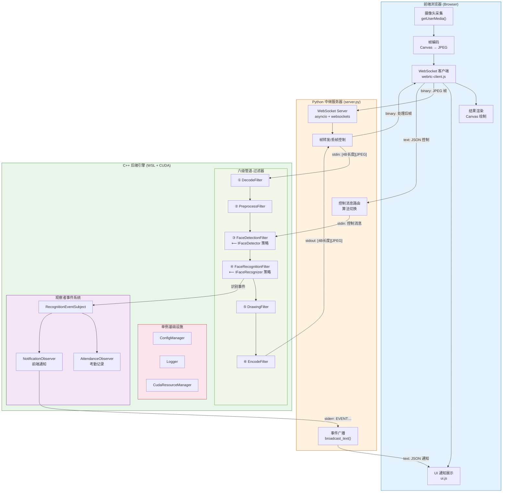
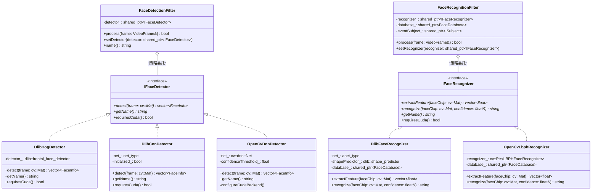
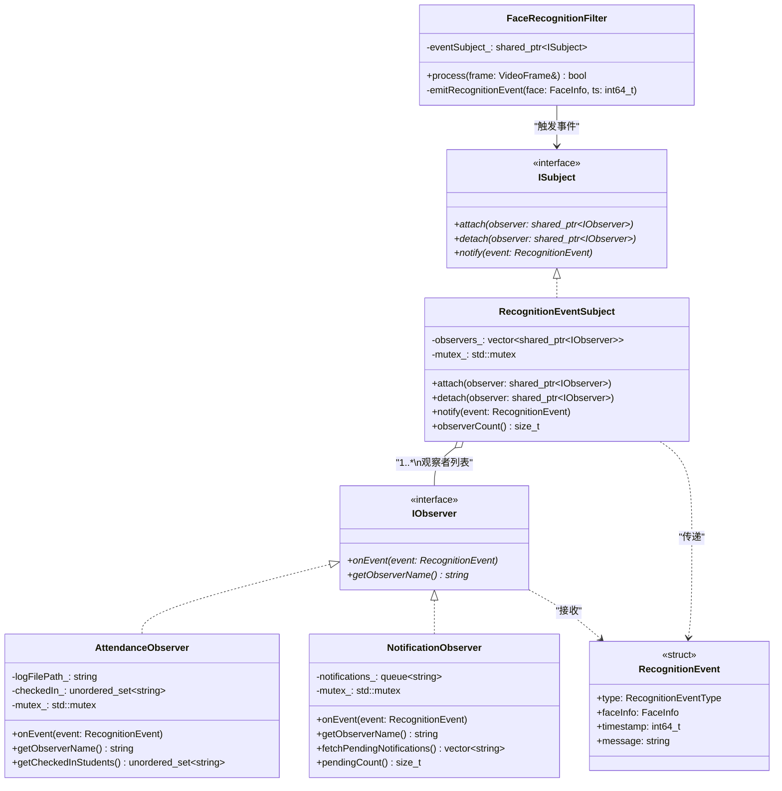
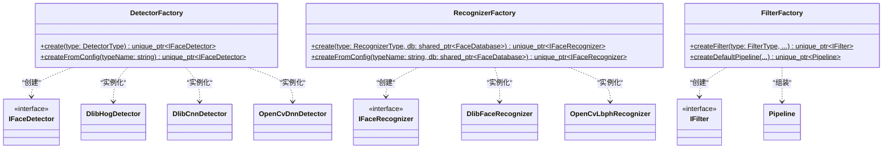
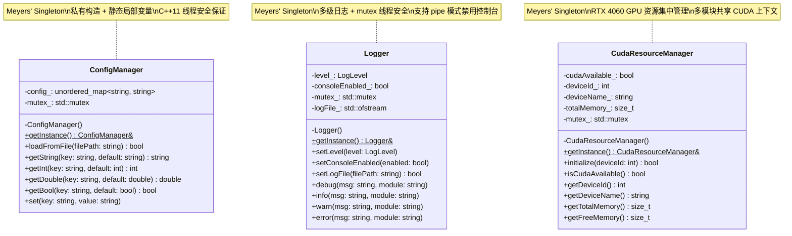
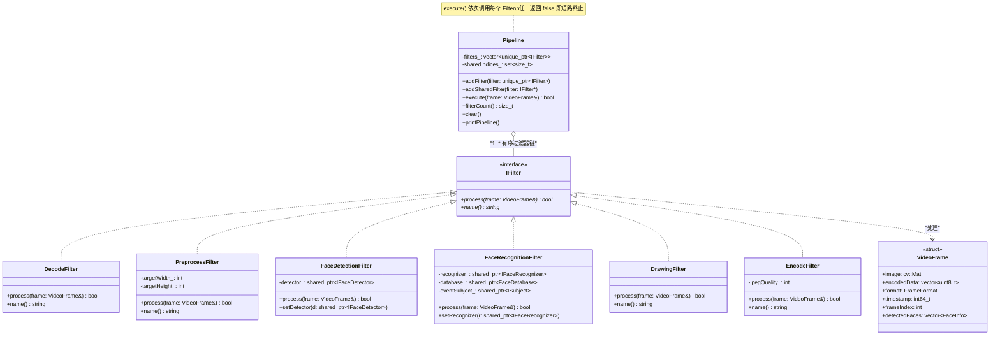
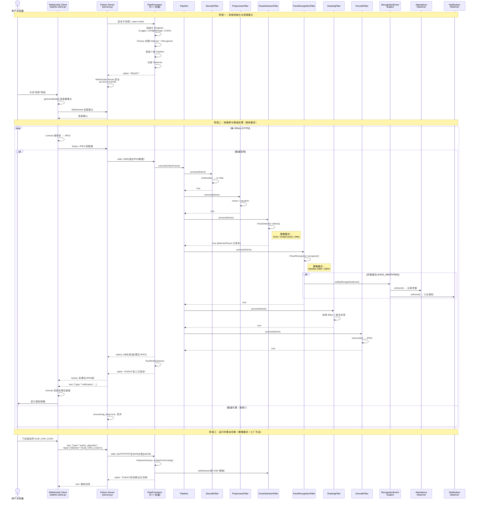

# 基于 WebRTC/OpenCV/Dlib 的智慧教室人脸跟踪识别系统——软件体系结构与设计模式分析报告

---

## 摘要

本报告以一个基于 WebRTC、OpenCV 和 Dlib 的智慧教室人脸跟踪识别系统为研究对象，从**软件体系结构**和**设计模式**两个维度对其进行深入剖析。系统采用 B/S 分布式架构，前端通过浏览器采集视频帧并以 WebSocket 协议传输至后端，后端 C++ 引擎通过六级管道-过滤器（Pipeline-Filter）架构完成帧解码、预处理、人脸检测、身份识别、标注绘制和编码回传的完整处理链路，并支持运行在 WSL 环境下的 NVIDIA CUDA GPU 加速推理。在设计模式层面，系统综合运用了**策略模式**、**观察者模式**、**工厂方法模式**、**单例模式**以及**管道-过滤器架构模式**，实现了算法可插拔、事件松耦合、对象创建集中化和全局资源统一管理的工程目标。本报告结合完整源代码，通过 UML 类图和时序图等形式化手段，逐一呈现各模式在系统中的角色映射与协作关系。

---

## 一、项目体系结构分析

### 1.1 整体架构风格提炼

经过对系统源代码的全面分析，本项目融合了以下三种核心软件体系结构风格：

| 架构风格 | 在本系统中的体现 | 核心价值 |
|---------|----------------|---------|
| **B/S 分布式架构** | 前端浏览器 (HTML5/JavaScript) ↔ Python 信令/中继服务器 ↔ C++ 后端引擎 | 零客户端部署，跨平台访问 |
| **前后端分离架构** | 前端仅负责视频采集与结果渲染，后端封装全部计算密集型业务逻辑 | 关注点分离，独立演化 |
| **管道-过滤器 (Pipe-and-Filter)** | 后端视频处理引擎由 6 个职责单一的 `IFilter` 实现类串联而成 | 高内聚低耦合，过滤器可独立替换 |

**B/S 分布式架构**：前端浏览器通过 `navigator.mediaDevices.getUserMedia()` 获取本地摄像头视频流，以 WebSocket 二进制帧的形式将 JPEG 数据发送至 Python 中继服务器（`signaling/server.py`）。Python 服务器通过管道（stdin/stdout）与 C++ 后端子进程通信，形成了 **Browser → Python WebSocket Server → C++ Engine** 的三层分布式处理链路。

**前后端分离**：前端代码（`frontend/`）与后端代码（`src/`）在物理上完全隔离。前端通过 WebSocket 协议与后端交互，数据格式约定为二进制 JPEG 帧（下行/上行均为纯帧数据）和 JSON 文本消息（控制指令与事件通知）。二者之间不存在任何编译期依赖。

**管道-过滤器**：后端的核心视频处理逻辑遵循经典的管道-过滤器 (Pipe-and-Filter) 体系结构风格。统一的 `IFilter` 接口定义了 `process(VideoFrame&)` 方法，6 个具体过滤器——`DecodeFilter`、`PreprocessFilter`、`FaceDetectionFilter`、`FaceRecognitionFilter`、`DrawingFilter`、`EncodeFilter`——通过 `Pipeline` 编排器串联成一条完整的处理管道。数据对象 `VideoFrame` 作为"数据流"在各过滤器之间依次传递和增量填充。

### 1.2 系统整体架构图



### 1.3 一帧视频数据的完整生命周期

以下详细描述一帧视频从前端采集到后端处理、再回传至前端展示的全部流转过程：

**阶段 1：前端采集与编码**
前端 `webrtc-client.js` 以 5 FPS 的频率，通过离屏 `<canvas>` 从 `<video>` 元素捕获当前帧画面，调用 `canvas.toBlob()` 将其编码为 JPEG 格式（质量 0.75），并通过 WebSocket 以二进制消息发送至 Python 服务器。

**阶段 2：Python 中继与进程间通信**
Python 服务器 `server.py` 接收到二进制 JPEG 数据后，进入 `send_frame_to_backend()` 方法。该方法通过**帧跳过机制**（`processing_busy` 标志）判断管道是否正忙——若前一帧尚未处理完毕则直接丢弃当前帧，避免帧积压导致延迟累积。若管道空闲，则按 `[4字节大端序长度][JPEG数据]` 的二进制协议将帧写入 C++ 子进程的 stdin，随后阻塞等待 stdout 返回处理结果。

**阶段 3：C++ 管道处理（六级过滤器）**
C++ 后端 `PipeProcessor::run()` 从 stdin 读取帧数据后，构建 `VideoFrame` 对象并提交至 `Pipeline::execute()`。6 个过滤器依次执行：

| 过滤器 | 职责 | 输入 → 输出 |
|--------|------|------------|
| **DecodeFilter** | JPEG 解码 | `encodedData` (JPEG) → `image` (cv::Mat BGR) |
| **PreprocessFilter** | 图像预处理（缩放、直方图均衡） | `image` 尺寸归一化 |
| **FaceDetectionFilter** | 人脸检测（委托 `IFaceDetector` 策略） | `image` → `detectedFaces[]` (位置+置信度) |
| **FaceRecognitionFilter** | 身份识别（委托 `IFaceRecognizer` 策略），触发观察者事件 | `detectedFaces[]` → 填充 `identity` 字段 |
| **DrawingFilter** | 绘制包围框与身份标签 | 在 `image` 上叠加可视化标注 |
| **EncodeFilter** | JPEG 编码 | `image` (cv::Mat) → `encodedData` (JPEG) |

**阶段 4：观察者事件分发**
当 `FaceRecognitionFilter` 成功识别出某位已注册学生时，通过 `RecognitionEventSubject::notify()` 向所有注册的观察者广播 `RecognitionEvent`。`AttendanceObserver` 记录考勤日志（去重），`NotificationObserver` 将消息加入待推送队列。`PipeProcessor` 在每帧处理后调用 `flushNotifications()` 将队列中的通知通过 stderr 以 `EVENT:...` 前缀输出。

**阶段 5：结果回传与前端渲染**
C++ 引擎将编码后的 JPEG 帧通过 stdout 写回，Python 服务器读取后以二进制 WebSocket 消息转发给前端。前端 `renderProcessedFrame()` 方法将 ArrayBuffer 转换为 Blob → Object URL → `Image` 对象，最终绘制到右侧 `<canvas>` 上。事件通知则以 JSON 文本消息形式广播，前端 `addNotification()` 方法将其渲染为弹幕通知。

---

## 二、设计模式深度剖析

### 2.1 策略模式 (Strategy Pattern)

#### 设计意图与解决的痛点

智慧教室人脸识别系统需要同时支持**多种检测算法**（Dlib HOG、Dlib CNN CUDA、OpenCV DNN）和**多种识别算法**（Dlib ResNet 128D、OpenCV LBPH），并允许用户在运行时通过前端 UI 动态切换。如果不采用策略模式，检测和识别逻辑中将充斥 `if-else` 或 `switch-case` 分支：

```cpp
// 反模式：没有策略模式的代码
if (algorithmType == "HOG") {
    // 50 行 HOG 检测代码...
} else if (algorithmType == "CNN") {
    // 80 行 CNN 检测代码...
} else if (algorithmType == "DNN") {
    // 60 行 DNN 检测代码...
}
```

这会导致"**过长的条件分支**"（Long Method / Switch Statements）和"**违反开闭原则**"（OCP）——每新增一种算法都需要修改已有的检测/识别代码，引入回归风险。

策略模式将每种算法封装为独立的策略类，通过统一的抽象接口 `IFaceDetector` / `IFaceRecognizer` 实现多态分发，使得新增算法只需新增一个类文件，无需修改任何已有代码。

本系统进一步构成了**双层策略模式**——检测与识别是两个正交维度的算法变化点，分别由 `IFaceDetector` 和 `IFaceRecognizer` 两套策略体系独立管理，实现了 $3 \times 2 = 6$ 种算法组合的自由配置。

#### 代码映射关系

**检测层策略**：
- **策略接口 (Strategy)**：`IFaceDetector`——定义 `detect(const cv::Mat&)` 和 `getName()` 抽象方法
- **具体策略 A (ConcreteStrategy)**：`DlibHogDetector`——纯 CPU HOG+SVM 检测
- **具体策略 B (ConcreteStrategy)**：`DlibCnnDetector`——CUDA 加速 CNN (MMOD) 检测
- **具体策略 C (ConcreteStrategy)**：`OpenCvDnnDetector`——OpenCV DNN SSD 检测（可选 CUDA 后端）
- **上下文 (Context)**：`FaceDetectionFilter`——通过 `shared_ptr<IFaceDetector> detector_` 持有策略对象，并通过 `setDetector()` 支持运行时热切换

**识别层策略**：
- **策略接口 (Strategy)**：`IFaceRecognizer`——定义 `extractFeature()` 和 `recognize()` 抽象方法
- **具体策略 A (ConcreteStrategy)**：`DlibFaceRecognizer`——ResNet 提取 128D 特征向量 + 欧氏距离比对
- **具体策略 B (ConcreteStrategy)**：`OpenCvLbphRecognizer`——LBPH 局部二值模式直方图
- **上下文 (Context)**：`FaceRecognitionFilter`——通过 `shared_ptr<IFaceRecognizer> recognizer_` 持有策略对象

**运行时切换机制**：前端 UI 选择算法 → WebSocket JSON 控制消息 → Python 路由 → C++ `PipeProcessor::handleControlMessage()` 解析 → 调用 `DetectorFactory::createFromConfig()` / `RecognizerFactory::createFromConfig()` 创建新策略 → 注入 `FaceDetectionFilter::setDetector()` / `FaceRecognitionFilter::setRecognizer()`。

#### UML 类图



---

### 2.2 观察者模式 (Observer Pattern)

#### 设计意图与解决的痛点

当 `FaceRecognitionFilter` 成功识别一张人脸后，系统需要执行多种异构的业务响应——记录考勤日志、向前端推送通知弹幕、触发安全告警等。如果将这些响应逻辑直接耦合在识别代码中：

```cpp
// 反模式：识别完成后直接调用各业务模块
void recognizeFace(...) {
    // 识别逻辑...
    attendanceLogger.record(student);     // 强依赖考勤模块
    notificationService.send(student);    // 强依赖通知模块
    securityAlarm.check(student);         // 强依赖安防模块
}
```

会导致"**过大的类**"（Large Class）和识别模块与各业务模块之间的**紧耦合**。每新增一种业务响应（如统计分析、家长通知），都需要修改识别代码，**违反开闭原则** (OCP)。

观察者模式将**事件源**（`RecognitionEventSubject`）与**事件处理者**（各 `IObserver` 实现）完全解耦。新增任何业务响应只需实现 `IObserver` 接口并调用 `attach()` 注册，识别模块无需做任何修改。

#### 代码映射关系

- **抽象主题 (Subject)**：`ISubject`——定义 `attach()`、`detach()`、`notify()` 接口
- **具体主题 (ConcreteSubject)**：`RecognitionEventSubject`——管理 `vector<shared_ptr<IObserver>>` 观察者列表，`notify()` 方法遍历列表逐一调用 `onEvent()`
- **抽象观察者 (Observer)**：`IObserver`——定义 `onEvent(const RecognitionEvent&)` 回调接口
- **具体观察者 A (ConcreteObserver)**：`AttendanceObserver`——监听 `FACE_IDENTIFIED` 事件，通过 `unordered_set<string> checkedIn_` 去重后记录考勤
- **具体观察者 B (ConcreteObserver)**：`NotificationObserver`——监听所有事件类型，将通知消息加入 `queue<string> notifications_` 队列，供 `PipeProcessor` 通过 stderr 推送至前端
- **事件数据**：`RecognitionEvent` 结构体——包含 `RecognitionEventType`（DETECTED / IDENTIFIED / UNKNOWN）、`FaceInfo`、时间戳和描述消息
- **事件触发点**：`FaceRecognitionFilter::emitRecognitionEvent()`——在识别完成后构造 `RecognitionEvent` 并调用 `eventSubject_->notify()`

#### UML 类图



---

### 2.3 工厂方法模式 (Factory Method Pattern)

#### 设计意图与解决的痛点

系统中各类对象的创建逻辑存在显著差异且普遍复杂。以人脸检测器为例：
- `DlibHogDetector`：无需外部模型，直接使用 Dlib 内建的 HOG 检测器
- `DlibCnnDetector`：需要加载约 700MB 的 `mmod_human_face_detector.dat` 模型文件，且必须检查 CUDA 设备可用性
- `OpenCvDnnDetector`：需要同时加载 `deploy.prototxt` 和 `res10_300x300_ssd_iter_140000.caffemodel` 两个文件，并可选地配置 CUDA 后端

如果在客户端代码（如 `main.cpp`）中直接 `new` 各种检测器，会产生以下代码坏味道：
- "**过长方法**"（Long Method）——`main()` 函数中充斥大量初始化和配置代码
- "**重复代码**"（Duplicated Code）——若多处需要创建同类型对象，初始化逻辑被重复
- "**特性依恋**"（Feature Envy）——客户端代码过度了解具体类的内部构造细节
- 客户端与具体实现类产生**编译期硬依赖**

本系统通过三个工厂类——`DetectorFactory`、`RecognizerFactory`、`FilterFactory`——将所有创建逻辑集中封装。客户端仅需指定类型枚举或配置字符串，即可获得面向抽象接口的实例，彻底消除了对具体类的直接依赖。

#### 代码映射关系

- **工厂类 A**：`DetectorFactory`——提供 `create(DetectorType)` 和 `createFromConfig(string)` 静态方法，根据类型枚举或配置字符串创建 `IFaceDetector` 实例
- **工厂类 B**：`RecognizerFactory`——提供 `create(RecognizerType, FaceDatabase)` 和 `createFromConfig(string, FaceDatabase)` 静态方法，创建 `IFaceRecognizer` 实例并注入 `FaceDatabase` 依赖
- **工厂类 C**：`FilterFactory`——提供 `createFilter(FilterType, ...)` 创建单个过滤器，以及 `createDefaultPipeline(...)` 一键组装完整的六级管道
- **工厂类 D**：`TrackFactory`——封装 WebRTC 视频/音频轨道的创建逻辑

工厂方法与策略模式在运行时算法切换场景中紧密协作：`PipeProcessor::handleControlMessage()` 收到前端的算法切换指令后，调用 `DetectorFactory::createFromConfig()` 创建新的策略实例，再通过 `FaceDetectionFilter::setDetector()` 注入——**工厂负责"创建什么"，策略负责"如何使用"**。

#### UML 类图



---

### 2.4 单例模式 (Singleton Pattern)

#### 设计意图与解决的痛点

系统存在三类天然具有**全局唯一性**约束的资源：

1. **配置管理** (`ConfigManager`)：分散在各模块中的可配置参数（检测阈值、模型路径、CUDA 设备号、WebRTC STUN 服务器地址等），若各模块自行读取和管理配置文件，会导致"**散弹式修改**"（Shotgun Surgery）——修改一个配置项需要在多处代码中同步更新。

2. **日志管理** (`Logger`)：若各模块自行管理日志输出（有的写文件、有的写控制台、有的不输出），会导致"**发散式变化**"（Divergent Change）——日志格式或输出目标的修改散落在系统各处。

3. **CUDA 资源** (`CudaResourceManager`)：系统仅有一块 RTX 4060 GPU，多个模块（`DlibCnnDetector`、`OpenCvDnnDetector`、`DlibFaceRecognizer`）共享同一个 CUDA 上下文。若分散初始化 CUDA 设备，会导致"**重复代码**"（Duplicated Code）和潜在的资源冲突。

三个单例均采用 **Meyers' Singleton** 实现——利用 C++11 标准保证的局部静态变量线程安全初始化（ISO C++11 §6.7 [stmt.dcl] p4），无需额外的锁机制或双重检查锁 (DCLP)。

#### 代码映射关系

| 角色 | 类名 | 关键实现 |
|------|------|---------|
| **单例类 A** | `ConfigManager` | `static ConfigManager& getInstance()` 返回局部 `static` 实例；私有构造函数 + `delete` 拷贝/移动 |
| **单例类 B** | `Logger` | 同上模式；提供 `LOG_DEBUG/INFO/WARN/ERROR` 便捷宏，内部通过 `mutex_` 保证多线程安全输出 |
| **单例类 C** | `CudaResourceManager` | 同上模式；提供 `initialize(deviceId)`、`isCudaAvailable()`、`getDeviceName()` 等查询接口 |

三者在 `main.cpp` 的 Phase 1 中按依赖顺序完成初始化：Logger → ConfigManager → CudaResourceManager。

#### UML 类图



---

### 2.5 管道-过滤器架构模式 (Pipeline-Filter Architectural Pattern)

#### 设计意图与解决的痛点

视频帧处理是本系统的核心计算逻辑，涉及**解码→预处理→检测→识别→绘制→编码**六个处理阶段。如果将所有逻辑写在一个大函数中：

```cpp
// 反模式：所有处理逻辑耦合在一个函数中
VideoFrame processFrame(const uint8_t* data, size_t size) {
    cv::Mat img = cv::imdecode(...);                    // 解码
    cv::resize(img, img, cv::Size(640, 480));            // 预处理
    auto faces = hogDetector.detect(img);                // 检测
    for (auto& face : faces) { recognizer.identify(...); } // 识别
    for (auto& face : faces) { cv::rectangle(...); }     // 绘制
    cv::imencode(".jpg", img, buffer);                   // 编码
    return frame;
}
```

会导致以下严重问题：
- "**过长方法**"（Long Method）——数百行代码集中在一个函数中
- "**发散式变化**"（Divergent Change）——修改任何一个处理步骤都要改动同一个函数
- **极低的可测试性**——无法对单个处理步骤进行单元测试
- **无法灵活重组**——例如调试时想跳过绘制步骤、或在检测前增加 ROI 裁剪步骤

管道-过滤器架构将每个处理步骤封装为独立的 `IFilter` 实现类，通过 `Pipeline` 编排器按序串联。每个 Filter 遵循**单一职责原则** (SRP)，仅关注自身的处理逻辑；Pipeline 负责串联调度并实现**短路机制**——任一 Filter 返回 `false` 即终止后续处理。

#### 代码映射关系

- **管道接口/编排器**：`Pipeline` 类——内部维护 `vector<unique_ptr<IFilter>> filters_`，`execute(VideoFrame&)` 方法依次调用每个 Filter 的 `process()` 方法
- **过滤器接口**：`IFilter`——定义 `process(VideoFrame&)` 和 `name()` 纯虚方法
- **数据流对象**：`VideoFrame` 结构体——包含 `cv::Mat image`、`vector<uint8_t> encodedData`、`vector<FaceInfo> detectedFaces` 等字段，在管道中被逐步填充和转换
- **六个具体过滤器**：

| # | Filter 类 | 职责 |
|---|-----------|------|
| 1 | `DecodeFilter` | 将 JPEG/H.264/VP8 编码数据解码为 `cv::Mat` |
| 2 | `PreprocessFilter` | 图像缩放、颜色空间归一化、直方图均衡化 |
| 3 | `FaceDetectionFilter` | 委托 `IFaceDetector` 策略进行人脸检测，结果写入 `detectedFaces` |
| 4 | `FaceRecognitionFilter` | 委托 `IFaceRecognizer` 策略进行身份识别，触发观察者事件 |
| 5 | `DrawingFilter` | 根据检测/识别结果在图像上绘制包围框和身份标签 |
| 6 | `EncodeFilter` | 将处理后的 `cv::Mat` 编码为 JPEG 格式输出 |

#### UML 类图



---

## 三、核心业务时序图

以下时序图展示了从前端发起连接到完成一帧视频处理的完整动态交互过程：



---

## 四、总结与工程实践亮点

### 4.1 技术亮点

**1. 管道-过滤器与策略模式的正交组合**
`FaceDetectionFilter` 和 `FaceRecognitionFilter` 是管道-过滤器架构与策略模式的**交叉点**——对外遵循 `IFilter` 接口融入管道，对内通过 `IFaceDetector` / `IFaceRecognizer` 接口委托给可替换的算法策略。这种正交设计使得管道结构与算法选择成为两个独立的变化维度，可分别演化而互不影响。

**2. 双层策略体系与运行时热切换**
检测算法和识别算法构成 $3 \times 2 = 6$ 种组合的双层策略空间，通过前端 UI → WebSocket → 控制消息 → 工厂方法 → 策略注入的完整链路，实现了算法的运行时无缝切换，无需重启后端进程。

**3. CUDA 异构计算的架构级封装**
`CudaResourceManager` 单例将 GPU 资源管理从各算法实现中抽离，`IFaceDetector::requiresCuda()` 方法在接口层声明硬件需求，`DetectorFactory` 在创建时自动检查 CUDA 可用性并优雅降级——形成了从接口声明到工厂检查到资源管理的三层 CUDA 治理体系。

**4. 帧级流控与丢帧策略**
Python 中继服务器通过 `processing_busy` 标志实现了**忙时丢帧**机制。当 C++ 管道正在处理前一帧时，新到达的帧被直接丢弃，从而避免帧积压导致的延迟累积，保障了系统的实时性。

**5. 观察者模式的异步解耦**
识别事件通过观察者模式实现了核心计算管道与业务响应逻辑的彻底解耦。`NotificationObserver` 的消息队列设计使得事件通知可以在管道处理的间隙批量刷新（`flushNotifications()`），避免阻塞主处理流程。

### 4.2 学术总结

本系统以智慧教室人脸识别这一具有现实意义的应用场景为载体，将《软件体系结构与设计模式》的核心理论知识系统性地落地实践。在**体系结构层面**，系统采用 B/S 分布式架构实现了零部署客户端，以管道-过滤器架构风格将复杂的视频处理逻辑分解为职责单一、可独立测试的处理单元。在**设计模式层面**，系统综合运用了策略模式（双层算法解耦）、观察者模式（事件驱动的业务响应）、工厂方法模式（对象创建逻辑集中化）和单例模式（全局资源统一管理），各模式之间协同配合——工厂创建策略实例、策略嵌入管道过滤器、过滤器触发观察者事件——形成了一套层次清晰、职责分明的软件架构体系。该实践充分印证了经典设计原则的工程价值：**开闭原则** (OCP) 使算法扩展无需修改已有代码；**单一职责原则** (SRP) 使每个过滤器和观察者聚焦于单一任务；**依赖倒置原则** (DIP) 使高层模块仅依赖抽象接口而非具体实现。理论与实践的有机融合，验证了软件体系结构与设计模式在构建高可维护性、高可扩展性实时系统中的关键作用。

---

> **附录：项目技术栈**
>
> | 层次 | 技术选型 |
> |------|---------|
> | 前端 | HTML5 Canvas, JavaScript ES6, WebSocket API |
> | 中继层 | Python 3, asyncio, websockets |
> | 后端引擎 | C++17, OpenCV 4.x, Dlib 19.x, nlohmann/json |
> | GPU 加速 | NVIDIA CUDA (RTX 4060), cuDNN |
> | 构建系统 | CMake 3.28 |
> | 运行环境 | WSL2 (Windows Subsystem for Linux) |
